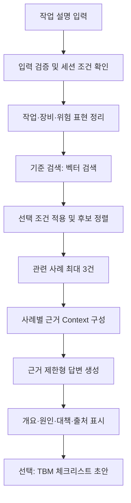
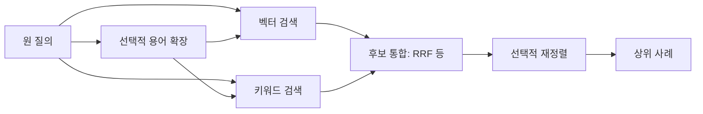
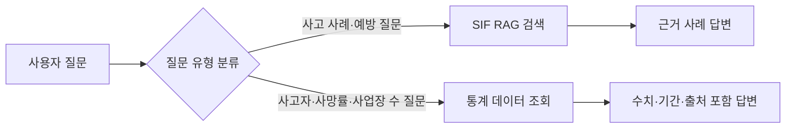
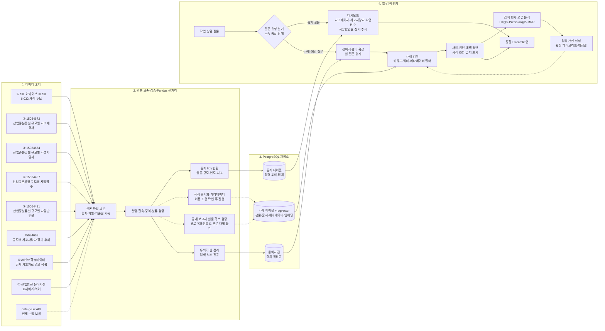

# 산업재해 유사사고 검색·TBM 지원 RAG — 최종 설계도

- 작성일: 2026-09-28
- 상태: 구현 기준 설계
- 기준 자료: SIF 아카이브 XLSX, `00_agent_rag_learning_map.md`, 산업재해 RAG 프로젝트 기획

## 1. 프로젝트 요약

현장 작업자가 수행할 작업을 입력하면 한국산업안전보건공단 SIF 아카이브에서 유사한 실제 산업재해 사례를 검색하고, 사례의 재해개요·위험요인·위험성 감소대책을 출처와 함께 보여주는 안전관리 지원 도구를 만든다. 사용자는 검색된 대책을 바탕으로 TBM 체크리스트 초안을 만들 수 있다.

> 작업 정보를 입력하면 실제 유사 사고와 그 원인·예방대책을 출처와 함께 찾아 작업 전 안전 확인을 돕는 RAG 서비스.

**핵심 원칙:** 사고사례 검색과 근거 제시가 중심이다. 생성형 모델은 검색 근거를 요약하고 정리하며, 근거에 없는 사고 사실·법규·안전기준을 만들어내지 않는다.

## 2. 기존 Agent RAG 학습 지도와의 연결

`00_agent_rag_learning_map.md`는 FAQ를 이용해 Vector Store, Retriever, Tool, Agent, CSV 저장을 학습하는 범용 교재로 유지한다. 이 프로젝트는 그 뒤에 붙이는 **산업재해 SIF RAG 실전 트랙**이다.

| 학습 지도 단원 | 실전 트랙에서 적용할 내용 |
|---|---|
| 환경과 초기화 | SIF XLSX 입력, PostgreSQL 연결, 임베딩 설정 |
| Vector Store와 Document | 사례 문서, 안정적인 `case_id`, 원본 위치 metadata |
| Retriever | 작업 설명 기반 검색, 상위 사례 수, similarity/MMR 비교 |
| Tool과 Schema | 검색 도구의 입력과 출력 계약 |
| Agent 실행 | 기본 검색 RAG 검증 이후 선택적으로 검색 Tool 연결 |
| CSV 저장·검증 | MVP 필수 기능에서 제외. 평가 결과 내보내기가 필요할 때 재사용 |
| 디버깅 | 원본 → 정제 → 검색 결과 → 답변 근거 순으로 점검 |

실습은 **Agent 없이 기준 검색 파이프라인부터 완성**한다. 검색 품질과 인용을 확인한 뒤 Agent를 추가하면, 검색 문제와 Tool 선택 문제를 각각 설명하고 평가할 수 있다.

## 3. 목표와 범위

### MVP 필수 기능

1. 사용자가 작업 상황을 자연어로 입력한다.
2. SIF 아카이브에서 관련 사례를 검색한다.
3. 관련 사례를 최대 3건까지 제시한다.
4. 사례별 재해개요, 기인물, 고위험작업·상황, 재해유발요인, 위험성 감소대책을 구분해 보여준다.
5. 사례 ID와 원본 시트·행을 표시해 사용자가 근거를 확인할 수 있게 한다.
6. 근거가 부족하면 단정하지 않고 검색 한계를 알린다.

### 후속 기능

- 검색된 사례의 대책을 기반으로 TBM 체크리스트 초안 생성
- 유의어 사전 기반 질의 확장
- 키워드와 벡터 하이브리드 검색, 재정렬
- RAG 질문과 통계 질문을 분기하는 Router
- 대화 세션에서 작업 조건과 선택 사례 유지
- 통계 Dashboard/SQL 연동

### MVP에서 제외

- SIF에 없는 법령 해석이나 안전기준의 자동 생성
- 산업재해 통계 CSV를 사고사례 벡터 문서와 혼합 적재
- 장기 대화 이력 관리
- 원문 근거가 없는 위험도 수치·사고 확률 산출
- 사용자 확인 없는 자동 안전조치 지시

## 4. 사용자와 대표 시나리오

- **주 사용자:** 안전관리자, 현장 작업 전 교육 담당자
- **사용 시점:** 작업 전 유사 사고 확인, 위험성평가 보조, TBM 준비
- **입력:** 자유문장. 필요하면 업종·작업 조건을 선택값으로 추가한다.

### 대표 시나리오

1. 사용자: “오늘 물류창고에서 지게차로 철제 자재를 하역합니다.”
2. 서비스: 관련 사례 최대 3건과 각 사례의 개요·원인·감소대책·출처를 제시한다.
3. 사용자: “끼임과 관련된 사례만 보여줘.”
4. 서비스: 기존 작업 맥락을 유지해 다시 검색하고, 선택 조건을 화면에 표시한다.
5. 사용자: “예방대책을 TBM 체크리스트로 정리해줘.”
6. 서비스: 이미 제시한 사례의 원문 대책을 바탕으로 체크리스트 초안을 작성하고 근거 사례를 연결한다.

후속 질의를 지원하려면 MVP에서도 현재 세션 안의 작업 설명·필터·선택 사례를 보존한다. 서버 재시작 뒤에도 남는 영구 대화 이력은 후속 범위다.

## 5. 데이터 구성

### 5.1 핵심 RAG 자료: SIF XLSX

파일: `한국산업안전보건공단_산업재해 고위험요인(SIF) 아카이브_20260401.xlsx`

| 시트 | 확인 사례 수 | 주요 필드 |
|---|---:|---|
| 아카이브(제조업등) | 2,573 | 대·중·소 업종, 재해개요, 기인물, 고위험작업·상황, 재해유발요인, 위험성 감소대책 |
| 아카이브(건설업) | 3,459 | 공종·작업 분류, 재해종류, 재해개요, 기인물, 재해유발요인, 위험성 감소대책 |
| 합계 | 6,032 | 사례 단위 문서 후보 |

건설업 시트는 두 줄의 분류 헤더 뒤에 사례 데이터가 시작된다. pandas 점검에서 제조업 등 2,573건, 건설업 3,459건의 연번이 모두 존재하고 연번·전체 행 중복은 확인되지 않았다. 제조업 등은 3행 헤더, 건설업은 3~4행의 다중 헤더 구조를 반영해 읽는다. 원본은 보존하며 적재 전 행 수·필수 필드·출처 위치를 다시 검증한다.

### 5.2 보조 자료

- **산업안전 용어사전:** 유의어·검색어 확장 실험에만 사용한다. 용어 정의를 사고 근거 또는 예방대책인 것처럼 제시하지 않는다.
- **사고재해자·사고사망자·사업장수·사망만인율 통계:** Dashboard/SQL 경로에서 사용한다. 사례 벡터 검색 문서와 섞지 않는다.
- **AI친화 사고정보·예방조치 자료:** 공개 보고서 경로를 찾는 목록으로 취급한다. 실제 원문을 확보하고 이용조건을 확인한 뒤 추가 코퍼스 여부를 결정한다.

## 6. 전처리와 데이터 계약

### 전처리 흐름

```text
원본 XLSX 보존
→ 시트/컬럼 탐색
→ 헤더와 사례 행 구분
→ 빈 사례·중복·필수 필드 점검
→ 원문 값 보존 및 정규화 값 생성
→ 안정적인 case_id 부여
→ 사례별 Document 생성
→ 검색 저장소 적재
→ 행 수와 샘플 출처 검증
```

### 문서 단위

초기 기준은 **사례 한 건 = 검색 문서 한 건**이다. 사례의 맥락과 예방대책이 함께 검색되도록 한다. 긴 사례에서 검색 품질이 떨어진다는 평가 증거가 있을 때만 필드별 문서 또는 청크 분할을 검토한다.

### 본문 형식 예시

```text
재해개요: 작업자가 컨베이어 점검 중 벨트 사이에 끼임
기인물: 컨베이어
고위험작업·상황: 비정형 설비 점검 작업
재해유발요인: 안전장치가 미설치되었거나 해제된 상태
위험성 감소대책: [원문 대책]
```

값이 없는 필드는 임의로 채우지 않는다. 원문 값과 정규화 값이 다른 경우 양쪽을 구별해 저장한다.

### 권장 공통 스키마

| 필드 | 용도 |
|---|---|
| `case_id` | 시트 식별자와 원본 연번 또는 행으로 만든 안정 ID |
| `source_file` | 원본 파일명 |
| `source_sheet` | 원본 시트명 |
| `source_row` | 원본 행 번호 |
| `source_serial` | 원본 연번(있는 경우) |
| `industry_major`, `industry_mid`, `industry_small` | 원본에 명시된 업종 정보 |
| `construction_work`, `construction_task`, `unit_task` | 원본에 있는 건설 작업 분류 |
| `disaster_type` | 원본에 명시된 재해종류 |
| `object` | 기인물 원문 |
| `high_risk_work` | 고위험작업·상황 원문 |
| `precursor` | 재해유발요인 원문 |
| `control_measure` | 위험성 감소대책 원문 |
| `embedding_text` | 검색용으로 구성한 텍스트 |

두 시트의 필드 차이를 보존한다. 제조업 등 자료에 없는 `disaster_type`을 추정해 공통 필터로 사용하지 않는다. 사용자가 지정한 명시적 조건만 hard filter에 적용하고, 모델이 불확실하게 추정한 값은 검색어에 반영하되 필터로 강제하지 않는다.

## 7. 시스템 아키텍처

### 7.1 MVP: 단일 RAG 경로



### 7.2 검색 개선 단계



용어 확장은 기본 질의를 대체하지 않는다. 원 질의 검색과 확장 질의 검색을 함께 실행하고, 동일 평가셋으로 확장 전후를 비교한다.

### 7.3 통계 연동은 별도 확장



Router와 통계 조회는 MVP 검색이 안정된 후 구현한다. 통계 질문은 SQL/집계 데이터로 답하고, SIF 사례 벡터 검색으로 수치를 산출하지 않는다.

### 7.4 전체 데이터·서비스 흐름도

통계 분석 경로와 사고사례 검색 경로는 전처리 이후 분리한다. PostgreSQL 인스턴스는 공유하되 통계 테이블과 사례 벡터 테이블을 구분한다. 점선은 수집 보류 또는 조건 확인 뒤 진행할 단계다.



**전체 흐름도 분기점 (2026-09-28):** 데이터 출처부터 대시보드·RAG·평가까지의 경로를 기준 아키텍처로 확정했다. 다음 구현 트랙은 이용 조건이 확인된 사고사례 코퍼스 확정과 Retriever 연결이다.

**현재 상태:** 업종·규모 통계와 용어사전의 Pandas 전처리 결과를 PostgreSQL에 적재했다. `industry_statistics` 1,200행, `fatality_trends` 220행, `safety_glossary_pairs` 7,169행이다. 사고사망자 대시보드는 산업중분류가 포함된 15084674를 주 지표로 쓰며, 15084663은 산업중분류가 없는 장기 추세 보조지표로 분리한다. PostgreSQL 17과 pgvector 0.8.6이 Docker Compose로 실행 중이고 `sif_cases`는 빈 테이블이다. 기존 서비스가 5432를 사용해 프로젝트 DB는 localhost:5433으로 연결한다. SIF는 읽기 전용 구조 점검까지만 했고, 이용 조건이 확인되기 전에는 본문 전처리·임베딩·벡터 적재를 진행하지 않는다. ⑥은 원문 보고서가 아니라 공개자료 경로 목록이다. 고용노동부·산업안전포털 후보도 개별 파일 이용조건이 확인되지 않아 색인을 보류한다. API 수집은 계속 보류 상태다. 출처별 판정은 `data/processed/rag_corpus_source_audit.md`를 참고한다.

## 8. 기술 구성

- **언어·처리:** Python, pandas/openpyxl
- **저장소·벡터 검색:** PostgreSQL + pgvector
- **임베딩·LLM:** 기존 학습 노트북의 모델 설정을 기준으로 재사용하되 환경변수로 관리
- **검색:** 기준선은 pgvector 유사도 검색. 이후 PostgreSQL 전문 검색/키워드 검색과 결합해 하이브리드화
- **UI:** 학습 초기는 노트북 또는 간단한 CLI, 데모는 Streamlit 단일 입력·결과 화면
- **비밀값:** `.env`의 `OPENAI_API_KEY`, `DB_URL` 등으로 분리하고 저장소에 커밋하지 않음

벡터 저장소는 PostgreSQL의 pgvector 확장으로 통일한다. 사례 metadata 필터와 벡터 유사도 검색을 같은 저장소에서 처리하고, 이후 통계 SQL도 같은 PostgreSQL 인스턴스에서 운영할 수 있다. ChromaDB는 사용하지 않는다. 이는 과제 안내에 적힌 ChromaDB 권장 스택과 다른 선택이므로, 제출 전 담당 강사에게 대체 허용 여부를 확인하는 것이 안전하다.

로컬 XLSX를 읽는 데 공공데이터포털 API 키는 필요하지 않다. 과제의 API 수집 항목은 별도의 공개 통계 API 호출로 충족하고, OpenAI 임베딩·LLM을 호출할 경우 별도 OpenAI API 키 및 사용 비용이 발생한다.

## 9. 검색·생성 규칙

1. 원 질의와 추출된 작업·장비·위험 표현을 기록한다.
2. 업종·작업 필터는 사용자가 선택했거나 신뢰할 수 있게 확인된 값에만 적용한다.
3. 사례 검색 결과에는 유사도 점수만으로 확정적 안전판정을 내리지 않는다.
4. 답변에서 재해개요, 재해유발요인, 위험성 감소대책을 분리한다.
5. 사실 서술은 검색된 사례에 근거하고 각 사례에 ID와 원본 위치를 표시한다.
6. 원문 대책을 요약할 때 의미를 바꾸지 않는다. 추가 해석을 했다면 원문과 생성된 체크 문장을 구별한다.
7. 법령 조항, 기준값, 위험도 점수 등 검색 자료에 없는 정보는 생성하지 않는다.
8. 검색 근거가 부족하거나 서로 맞지 않으면 그 한계를 답변에 표시한다.
9. TBM 출력은 “현장 검토용 초안”으로 표시하고, 각 항목에 근거 사례를 연결한다.

## 10. 평가 계획

### 평가 데이터

- 작업 상황 질문 30~50개를 작성한다.
- 각 질문에 대해 관련 사례 `case_id`를 사람이 지정한다.
- 업종·장비·작업·위험 유형이 한쪽으로 치우치지 않게 구성한다.
- 개발용 질문과 최종 비교용 질문을 분리한다.

### 검색 지표

- Hit Rate@K / Recall@K
- MRR
- 명시적 업종·작업 조건 준수율
- 근거 사례가 지나치게 중복되는지에 대한 점검

### 답변 품질 점검

- 답변 문장마다 근거 사례가 연결되는가
- 출처 ID·시트·행이 실제 사례와 일치하는가
- 원문 위험요인·대책의 의미를 보존하는가
- 관련 결과가 없을 때 무리한 답을 피하는가
- TBM 항목이 원문 근거와 추적 가능한가

### 실험 순서

```text
A. Vector baseline
B. Metadata + Vector
C. Keyword + Vector hybrid
D. Glossary query expansion
E. Reranking
```

한 번에 한 요소만 바꾸고 같은 질문 세트에서 결과를 비교한다. 먼저 기준선 결과를 기록한 뒤 개선 목표를 정한다.

### 공통 질문지·성능지표 데이터셋 운영안

검색 방식(BM25, pgvector, 하이브리드), 용어 확장, 재정렬을 공정하게 비교하기 위해 공통 질문지와 정답 사례 라벨을 버전 관리되는 평가 데이터셋으로 관리한다. 모든 검색 실험은 같은 질문, 같은 코퍼스 스냅샷, 같은 필터 조건과 결과 수를 사용한다.

- 초기에는 작업 상황 질문 30~50개를 작성하고 업종·장비·작업·위험 유형이 한쪽에 치우치지 않게 구성한다.
- 각 질문의 관련 사례 `case_id`를 사람이 검토해 지정한다. 라벨 검토가 끝나지 않은 질문은 성능 계산에서 제외한다.
- 키워드 수집 표본을 검색 대상으로 쓰는 경우 그 코퍼스 안에서 라벨링하고, 전체 SIF 아카이브의 성능으로 일반화하지 않는다.
- 질문은 개발용(`dev`)과 최종 비교용(`holdout`)으로 나눈다. 개발용은 검색 설정 조정에, 최종 비교용은 설정 선택 후 후보 비교에 사용한다.
- 질문지에는 질문 ID, 질문 문장, 업종 필터, 관련 사례 ID, 분할, 라벨 상태, 검토 메모를 기록한다. 미라벨 질문과 관련 사례가 없다고 검토된 질문을 상태로 구분한다.
- 현재 `data/evaluation/rag_questions.jsonl`을 기준 질문지로, `data/evaluation/rag_candidate_review.csv`를 라벨 검토 보조자료로 사용한다. 두 자료의 질문 ID와 확정 라벨을 일치시킨다.

권장 레코드 예시:

```json
{
  "id": "q001",
  "question": "지게차 작업 중 보행자 충돌을 예방하려면 어떤 조치가 필요한가?",
  "industry_filter": null,
  "expected_case_ids": ["case-id-1", "case-id-2"],
  "split": "dev",
  "status": "labeled",
  "review_note": "지게차 이동 중 보행자 충돌 및 분리 동선 대책이 직접 관련됨"
}
```

`expected_case_ids`가 빈 배열인 것만으로 무관련 질문이라고 간주하지 않는다. 라벨 상태가 검토 완료인 질문만 성능 계산에 포함한다.

기본 검색 비교 지표는 Hit Rate@3, Recall@3, MRR, Precision@3으로 하고, 명시적 업종·작업 조건 준수율과 결과 중복 여부를 별도로 기록한다. 필요하면 K=5를 보조 지표로 함께 낸다. 실행별로 질문지 버전, 코퍼스 버전 또는 입력 파일 식별값, 검색 방식·설정, 실행 시각, 질문별 결과·점수·관련 여부를 보존해 오류를 재현할 수 있게 한다. 답변 생성의 사실성·인용 정확도 평가는 검색 성능과 분리해 사람이 검토한다.

## 11. 구현 마일스톤과 학습 산출물

| 단계 | 구현 내용 | 학습 산출물 | 완료 기준 |
|---|---|---|---|
| 0. 원본 확인 | SIF 시트·컬럼·행·이용조건 확인 | 데이터 사전, 품질 점검 기록 | 원본 구조와 사례 수 설명 가능 |
| 1. 적재 준비 | 행 정제, ID·Metadata·문서 생성 | 전처리 노트북/스크립트 | 사례 단위 문서와 출처 필드 검증 |
| 2. 기준 검색 | 임베딩, pgvector 적재, 검색 UI/CLI | Retriever 실습 | 입력에 대해 사례와 출처 반환 |
| 3. 근거 답변 | Context 구성, 답변 프롬프트, 인용 | RAG 체인 실습 | 요약과 원문 근거를 구별 |
| 4. 평가 | 공통 질문지 버전 확정, 관련 사례 ID 검토·라벨링, 검색 비교 | 질문지 JSONL, 라벨 검토표, 실행별 결과표 | 같은 질문·코퍼스에서 기준선 지표와 오류 사례 재현 가능 |
| 5. Agent 연결 | 검색 Tool 스키마 및 호출 | Agent 실습 | 입력이 검색 Tool로 전달되고 근거 답변 반환 |
| 6. 검색 개선 | Hybrid, 용어 확장, reranking | 비교 실험 보고서 | 동일 평가셋 비교 결과 기록 |
| 7. 통합 데모 | TBM 초안, 필요 시 통계 Router/UI | README·시연 시나리오 | 사용자 흐름과 데이터 출처 설명 가능 |

### 00 학습 지도에 추가할 목차 제안

기존 15장 뒤에 다음 장을 연결한다.

- **16. SIF 원본 데이터 읽기와 품질검사**
- **17. 산업재해 사례 Document와 Metadata 설계**
- **18. 출처를 보존하는 사례 단위 적재**
- **19. 작업 설명으로 유사사례 검색**
- **20. 근거 제한형 답변과 TBM 초안**
- **21. 검색 평가셋과 오류 분석**
- **22. Hybrid·용어 확장·재정렬 비교**
- **23. 검색 Tool Agent 및 통계 Router 확장**

각 장은 `개념 → 왜 필요한가 → 입력/처리/출력 → 실행 실습 → 결과 확인 → 디버깅 질문` 형식을 유지한다. 기존 FAQ 예시의 `field/title`을 산업재해의 업종·작업·기인물 Metadata와 혼동하지 않도록 도메인별 예제를 분리한다.

## 12. 이용조건과 데이터 관리

공식 SIF 데이터 페이지는 출처표시·변경금지(공공누리 제3유형) 및 변경·2차적 저작물 작성 금지 조건을 안내한다. 따라서 원본 보존과 출처 표시는 기본으로 하고, 임베딩·정제본·벡터 DB를 외부에 배포하거나 서비스에 포함하기 전에는 제공기관에 허용 범위를 확인한다. 내부 학습·실험에 활용할 때도 원본과 가공 산출물의 배포 여부를 구분해 관리한다.

- 원본 파일과 가공 산출물을 별도 경로에 보관한다.
- 각 사례에 원본 파일·시트·행을 유지한다.
- API 키와 DB 비밀번호는 `.env`에만 두고 `.gitignore`에 등록한다.
- 데이터 라이선스 확인 전에는 원문·임베딩·벡터 DB를 공개 저장소에 포함하지 않는다.
- 공개 보고서 경로 목록 자체를 사고 본문 코퍼스로 간주하지 않는다. 개별 원문 파일의 권리표시를 manifest에 기록한다.

출처 후보별 공개 형태·이용조건·색인 판정은 [RAG 근거 코퍼스 출처 점검](../data/processed/rag_corpus_source_audit.md)에 기록한다.

공식 출처: [한국산업안전보건공단 SIF 아카이브](https://www.data.go.kr/data/15140383/fileData.do)

## 13. 최종 완료 기준

프로젝트 최종 시연에서 사용자가 실제 작업을 입력하고, 시스템이 SIF에서 관련 사례를 찾아 원인·대책과 출처를 제시해야 한다. 이후 같은 근거를 이용해 TBM 초안을 만들 수 있어야 한다. 발표자는 원본 데이터 처리, Document·Metadata 설계, 검색 과정, 평가 결과, 실패 사례와 한계를 설명할 수 있어야 한다.

통계 Dashboard와의 통합은 위 핵심 시연이 검증된 다음 단계로 완료한다.
