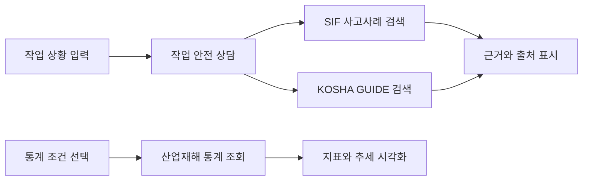

# 산업재해 안전 지원 RAG

현장 작업 정보를 입력하면 **SIF 실제 사고사례와 KOSHA GUIDE 안전기준을 검색해 근거와 함께 보여주고**, 별도 통계 화면에서 산업재해 현황을 살펴보는 팀 프로젝트입니다. 안전관리자와 작업 전 교육 담당자가 유사 사고를 확인하고 예방 검토를 준비할 때 사용하는 지원 도구를 지향합니다.

> 답변은 검색 근거를 확인하기 위한 참고 자료입니다. 현장 위험성평가와 안전관리자 지침을 대신하지 않습니다.

## 무엇을 만들었나요?

통합 Streamlit 앱에서 작업 안전 상담과 산업재해 통계를 제공합니다.

- **작업 안전 상담:** 작업 상황을 자연어로 입력하면 SIF 사고사례와 KOSHA GUIDE를 각각 검색하고, 관련 근거·출처를 나란히 보여줍니다. 대화 후속 질문도 지원합니다.
- **사례 직접 검색:** 검색 결과와 인용 출처를 확인하는 별도 화면입니다.
- **산업재해 통계:** 연도·산업·사업장 규모에 따라 사고재해자 수, 사고사망자 수, 사망만인율을 표와 그래프로 살펴봅니다.
- **근거 중심 응답:** 검색된 근거가 부족한 항목은 표시하고, 사례에 없는 안전기준이나 사실을 단정하지 않도록 설계했습니다.

### RAG와 통계는 이렇게 연결됩니다

RAG와 통계는 한 앱에서 제공하지만 데이터와 조회 경로는 분리되어 있습니다. 사고사례 검색 결과를 통계의 근거로 혼합하지 않으며, 통계 수치를 사고사례로 생성하지 않습니다.



## 기술 구성

| 영역 | 기술 |
| --- | --- |
| 앱과 화면 | Python 3.14, Streamlit |
| 검색·답변 | LangChain, OpenAI 임베딩·언어 모델 |
| 저장과 벡터 검색 | PostgreSQL, pgvector |
| 통계 처리와 시각화 | pandas, Plotly |
| 배포 데이터 선택지 | Supabase PostgreSQL 및 Private Storage |

## 빠르게 실행하기

### 준비 사항

- Python 3.14
- 프로젝트 의존성 설치 환경
- **작업 안전 상담:** DATABASE_URL 또는 SUPABASE_DB_URL로 연결하는 PostgreSQL에 SIF 사례와 kosha_guides 임베딩 데이터, OPENAI_API_KEY가 필요합니다.
- **사례 직접 검색:** data/processed/sif_rag_documents.jsonl 코퍼스를 별도로 준비해야 합니다. BM25 검색 결과 표시는 API 키 없이 가능하고, 답변 생성에는 OPENAI_API_KEY, pgvector 의미 검색에는 DB와 임베딩 데이터가 필요합니다.
- **통계:** 로컬 통계 CSV 또는 설정된 Supabase Private Storage 데이터가 필요합니다. 연결된 DB에 2025년 통계가 있으면 대체 조회 경로로 사용할 수 있습니다.
- 필요한 비밀값은 로컬 `.env` 또는 배포 환경의 Secrets에 설정합니다. `.env.example`에는 설정할 변수명만 있으며 실제 자격 증명은 포함하지 않습니다.

저장소를 복제한 뒤 PowerShell에서 프로젝트 루트 기준으로 실행합니다.

```powershell
py -3.14 -m venv .venv
./.venv/Scripts/python.exe -m pip install -r src/Project_1/requirements.txt
Copy-Item .env.example .env
# .env에 사용할 DB 주소와 OPENAI_API_KEY 등 필요한 로컬 설정
./.venv/Scripts/python.exe -m streamlit run streamlit_app.py
```

사이드바에서 **작업 안전 상담** 또는 **사례 직접 검색**을 선택합니다. 작업 안전 상담 화면의 **산업재해 현황** 탭에서 통계를 확인할 수 있습니다. 상담·검색 데이터는 저장소에 포함되어 있지 않으므로 사전에 접근 권한과 데이터 구성을 준비해야 합니다. 전체 PC 설정, DB 준비와 환경 변수 목록은 [팀원 PC 설정 안내](SETUP.md)를 참고하세요.

## 팀 협업과 문제 해결

기능별 브랜치에서 작업하고 Pull Request로 변경을 통합하는 흐름을 사용합니다. 실제 병합된 PR에서 확인할 수 있는 구현 사례입니다.

- [PR #23 — 출처 확인을 포함한 SIF 사례 검색 도구](https://github.com/encore-ai-campus/mle-02-p1-team2/pull/23): 검색 도구에서 사례 ID와 출처를 구조화해 반환하고, 인용 URL을 data.go.kr 공식 도메인으로 제한했습니다.
- [PR #24 — 평가 입력 준비도 점검](https://github.com/encore-ai-campus/mle-02-p1-team2/pull/24): 라벨·검토자·입력 완전성 조건을 검사해 사람 검토가 끝나지 않은 평가를 최종 지표로 처리하지 않도록 했습니다.

각 링크는 변경의 병합 이력을 보여줍니다. 특정 리뷰 승인이나 리뷰 횟수를 의미하지 않습니다. 팀의 브랜치·PR 규칙은 [CONTRIBUTING.md](CONTRIBUTING.md)와 [GIT_WORKFLOW.md](GIT_WORKFLOW.md)를 참고하세요.

## 데이터와 평가 범위

- SIF API 사례는 키워드로 수집한 표본이며 전체 아카이브가 아닙니다.
- SIF XLSX 원본과 정제·임베딩 산출물은 이용 조건이 확인되지 않으면 저장소에 공개하지 않습니다.
- 산업재해 통계는 정형 조회용이며 사례 RAG 코퍼스와 별도로 유지합니다.
- 평가 후보나 자동 판정은 사람 검토를 마친 정답 데이터와 구분합니다. 승인된 사람 검토 평가 근거가 없는 수치는 성능 성과로 제시하지 않습니다.
- `.env`, API 키, DB 비밀번호는 커밋하지 않습니다. 현재 파일은 [`.gitignore`](.gitignore)에서 무시되며, 필요한 환경 변수의 이름만 [`.env.example`](.env.example)에서 확인할 수 있습니다.

## 더 알아보기

- [프로젝트 목표와 범위](PROJECT_BRIEF.md)
- [시스템 아키텍처](docs/product-architecture.md)
- [RAG 설계와 데이터 흐름](docs/rag-architecture.md)
- [데이터 출처와 이용 범위](docs/data-sources.md)
- [실행 환경 설정](SETUP.md)
- [평가 데이터 작성 기준](docs/evaluation/golden-set-spec.md)
