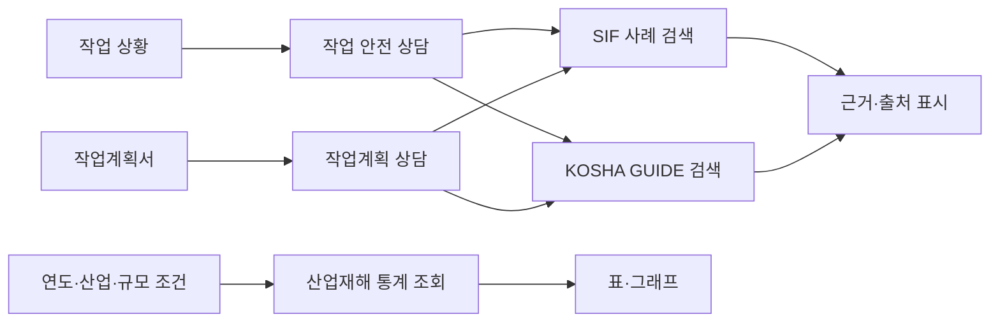

# 산업재해 안전 지원 RAG

현장 작업 정보와 관련된 **SIF 산업재해 사례**와 **KOSHA GUIDE 안전자료**를 찾아 출처와 함께 확인하고, 산업재해 통계를 별도로 살펴보는 팀 프로젝트입니다. 안전관리자와 작업 전 교육 담당자가 유사 사례와 안전자료를 검토할 때 활용하는 지원 도구를 지향합니다.

> 검색·생성 결과는 참고용입니다. 현장 위험성평가와 안전관리자 지침을 대신하지 않습니다.

## 프로젝트 화면과 기능

Streamlit 앱은 작업 안전 상담, 작업계획 상담, 산업재해 현황 화면을 제공합니다. 저장소에는 화면 캡처나 시연 영상이 포함되어 있지 않습니다. 실행 방법은 [빠른 실행](#빠른-실행)을 참고하세요.

| 기능 | 상태 | 설명 |
| --- | --- | --- |
| 작업 안전 상담 | 구현됨 · 데이터 연결 필요 | SIF 사고사례와 KOSHA GUIDE를 각각 검색해 근거와 출처를 표시합니다. 검색된 근거를 바탕으로 답변을 구성합니다. |
| 작업계획 상담 | 구현됨 · 권한/저장소 설정 필요 | 업로드한 작업계획 내용을 대화에 연결해 관련 SIF·KOSHA 근거를 검토합니다. 배포 환경의 접근 권한에 따라 사용 가능 범위가 달라집니다. |
| 산업재해 현황 | 구현됨 · 통계 데이터 필요 | 연도·산업·사업장 규모별 통계를 표와 그래프로 조회합니다. |
| 사례 직접 검색 | 구현된 로컬 프로토타입 | 별도 CLI로 SIF API 표본을 BM25 검색하고 사례 ID·출처를 확인할 수 있습니다. |
| 평가 결과 | 진행 중 | 후보 생성·검증 절차가 있습니다. 사람 검토가 완료된 골든 라벨과 승인된 최종 성능 수치로 간주하지 않습니다. |
| SIF XLSX 본문 전처리·임베딩 공개 | 보류 (HOLD) | 이용조건이 확인될 때까지 본문을 전처리하거나 임베딩 색인한 자료를 저장소에 공개하지 않습니다. |

## 시스템 구성

사고사례 검색과 산업재해 통계는 한 앱에서 제공하지만, 데이터와 조회 경로를 분리합니다. SIF 사례와 KOSHA GUIDE도 서로 다른 근거로 표시합니다.



## 기술 구성

| 영역 | 기술 |
| --- | --- |
| 앱 | Python 3.12.15, Streamlit |
| 검색·답변 | LangChain, OpenAI 임베딩·언어 모델 |
| 저장·벡터 검색 | PostgreSQL, pgvector |
| 통계 처리·시각화 | pandas, Plotly |
| 배포 선택지 | Supabase PostgreSQL 및 Private Storage |

## 빠른 실행

### 준비 사항

- WSL2 Ubuntu, Python 3.12.15, uv
- 앱 실행에 필요한 통계 데이터와 SIF·KOSHA 검색 데이터가 연결된 PostgreSQL 또는 설정된 로컬 데이터
- 생성형 답변·임베딩 기능을 사용할 경우 `OPENAI_API_KEY`
- 필요한 값은 로컬 `.env` 또는 배포 환경의 Secrets에 설정합니다. 저장소의 `.env.example`에는 변수명만 있으며 자격 증명이 없습니다.

WSL2 Ubuntu에서 저장소 루트로 이동해 실행합니다. Python 설치와 가상환경 준비는 [팀원 PC 설정 안내](SETUP.md)를 따릅니다.

```bash
cd ~/workspace/your-checkout
uv sync --python "$HOME/.local/python/3.12.15/bin/python3.12"
uv pip install --python .venv/bin/python -r src/Project_1/requirements.txt
cp .env.example .env
# 필요한 로컬 환경변수를 .env에 설정한 뒤 실행
.venv/bin/python -m streamlit run streamlit_app.py
```

필요한 데이터와 DB 설정은 PC마다 다를 수 있습니다. 엔트리포인트와 데이터베이스 준비는 [팀원 PC 설정 안내](SETUP.md)를 확인하세요. 로컬 SIF 검색 CLI는 다음처럼 실행합니다.

```bash
.venv/bin/python -m src.sif_rag.rag_cli "지게차 작업 중 보행자 충돌을 예방하려면?" -k 2
```

CLI의 기본 코퍼스는 `data/processed/sif_rag_documents.jsonl`입니다. 데이터 파일은 저장소에 포함되어 있지 않으므로 [데이터 출처 안내](docs/data-sources.md)에 따라 별도로 준비해야 합니다.

## 데이터와 평가 원칙

- SIF OpenAPI 사례는 검색어로 수집한 표본이며 전체 아카이브가 아닙니다.
- SIF 아카이브 XLSX의 변경·임베딩·외부 배포 이용 범위를 확인하기 전까지 본문 전처리와 색인을 보류합니다.
- 산업재해 통계는 정형 조회용이며 사고사례 검색 문서와 혼합하지 않습니다.
- 후보 데이터와 자동 점검 결과는 사람 검토를 마친 정답 데이터와 구분합니다. 검토되지 않은 평가는 최종 성능으로 보고하지 않습니다.
- 원본·가공 데이터와 평가 산출물은 기본적으로 Git에 포함하지 않습니다. 출처·수집 현황은 [데이터 출처 안내](docs/data-sources.md), 저장 원칙은 [데이터 안내](data/README.md)를 확인하세요.
- `.env`, API 키, DB 비밀번호를 커밋하지 않습니다. `.gitignore`가 `.env` 파일을 제외하고 `.env.example`만 추적하도록 설정되어 있습니다.

## 팀 협업과 이력

기능별 브랜치에서 작업하고 `main` 대상 Pull Request로 변경을 검토·통합합니다. 아래 링크는 병합된 변경 사례이며, 특정 PR에 별도 리뷰 승인이 있었다고 이 README가 주장하지는 않습니다.

- [PR #23 — 출처 확인을 포함한 SIF 사례 검색 도구](https://github.com/encore-ai-campus/mle-02-p1-team2/pull/23)
- [PR #24 — 평가 입력 준비도 점검](https://github.com/encore-ai-campus/mle-02-p1-team2/pull/24)
- [PR #34 — 포트폴리오 README 정리](https://github.com/encore-ai-campus/mle-02-p1-team2/pull/34)

실제 작성자·리뷰어·승인 및 변경 요청 이력은 각 Pull Request의 GitHub 기록을 확인하세요. 팀 규칙은 [CONTRIBUTING.md](CONTRIBUTING.md), [GIT_WORKFLOW.md](GIT_WORKFLOW.md), [GPT와 Codex 순차 협업 안내](docs/codex-gpt-handoff.md)에 정리되어 있습니다.

## 문서

- [프로젝트 목표와 범위](PROJECT_BRIEF.md)
- [제품 아키텍처](docs/product-architecture.md)
- [RAG 아키텍처 및 데이터 흐름](docs/rag-architecture.md)
- [데이터 출처와 이용 범위](docs/data-sources.md)
- [팀원 PC 설정 안내](SETUP.md)
- [평가 데이터 제작 기준](docs/evaluation/golden-set-spec.md)
- [데이터 파일과 공개 범위 원칙](data/README.md)
