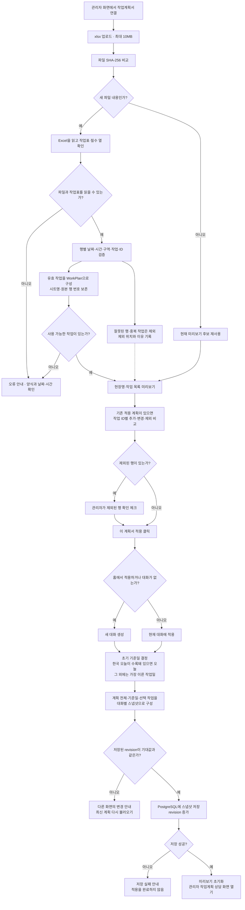
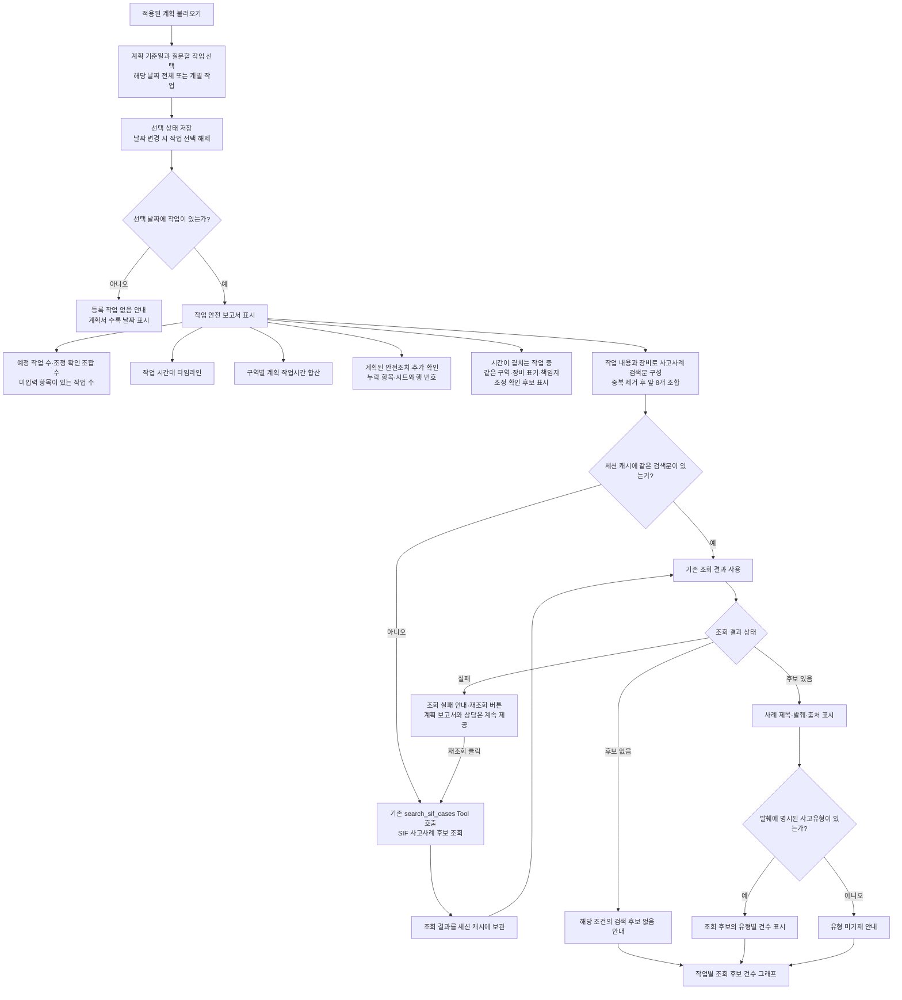
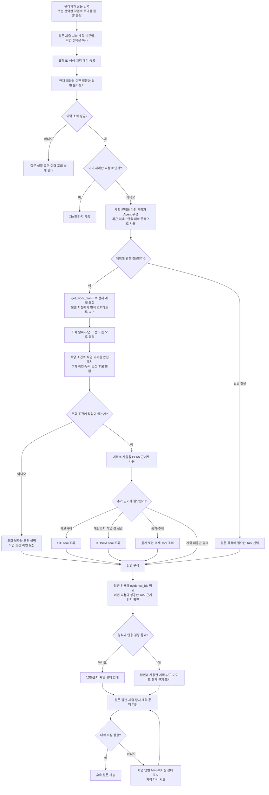
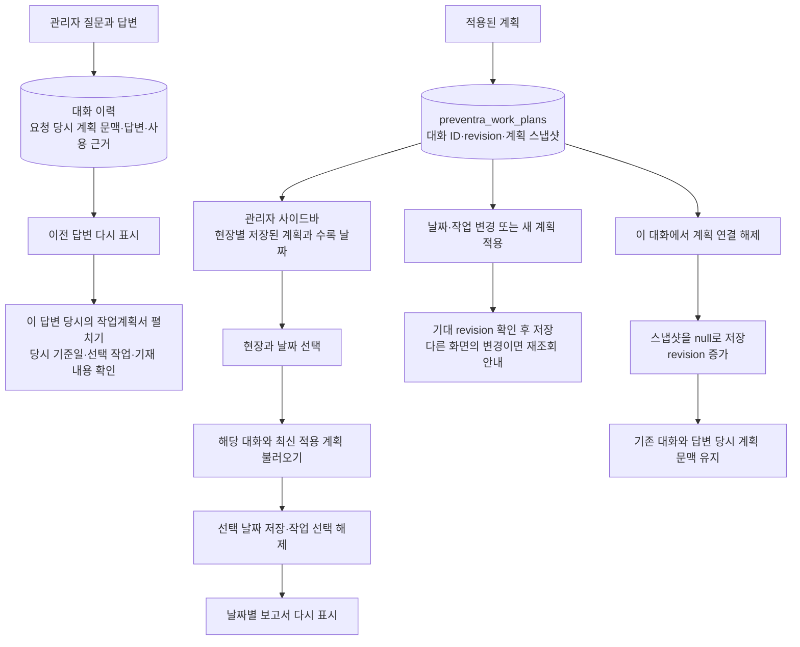

# 관리자 모드 · 작업계획서 처리 흐름

기준: `feature/preventra-plus`의 `4808932` 커밋, 2026-10-07 확인. 관리자 화면에서 계획서를 연결한 이후의 실제 코드 흐름을 정리했다.

## 1. Excel 업로드 → 검토 → 적용

- 필수 열은 작업일·시작·종료·동/구역·작업 내용이다. 작업 ID가 없으면 작업의 날짜·시간·구역·내용으로 자동 ID를 만든다.
- 파일 전체는 최대 10,000행, 유효 작업은 최대 500개다. 작업 행의 오류는 제외 목록으로 보여 주며, 유효 작업이 전혀 없으면 적용할 수 없다.
- 원본 Excel 파일은 저장하지 않는다. 파싱한 계획과 선택 상태를 저장한다. 미리보기만으로 계획이 적용되지는 않는다.

## 2. 적용된 계획 → 날짜별 작업 안전 보고서

- 보고서의 SIF 조회는 보고서를 표시할 때 자동으로 실행된다. 별도의 상담 질문을 보낼 필요가 없다. 동일 검색문은 세션 캐시를 재사용하며 최대 64개를 보관한다.
- 시간대가 겹치고 구역·장비 표기·책임자 중 하나가 일치하면 조정 확인 후보가 된다. 최대 250개 조합을 표시하며, 개별 작업 선택 시 그 작업이 포함된 조합을 보여 준다.
- 구역별 시간은 작업별 예정 시간을 합산한다. 동시 작업도 각각 포함하고 인원수는 반영하지 않는다.
- 사고사례 그래프는 조회된 후보 건수다. 작업별 중복 사례와 검색 상한의 영향을 받는다. 전국 재해 통계·발생 확률·작업 위험도 점수로 해석하지 않는다.
- 선택 날짜에 작업이 없다는 안내는 계획서에 기재된 작업이 없다는 뜻이다. 실제 현장의 무작업을 확정하지 않는다.

## 3. 관리자 질문 → 계획 조회 → 근거 답변

- 계획서 질문의 오늘·당일·오전·오후는 화면에서 선택한 계획 기준일을 뜻한다. 내일·어제도 그 기준일의 다음 날·전날이다. 실제 오늘을 명시하면 한국 달력의 오늘을 조회한다.
- 다른 날짜를 명시하면 이전 날짜의 작업 선택을 이어받지 않는다. 전체 작업 요청은 선택을 해제해 해당 날짜 전체를 조회한다. 오전·오후는 정오 기준이며 정오를 걸치는 작업은 양쪽에 포함된다.
- 계획 Tool의 작업 내용과 조정 후보는 각각 앞 20개까지 모델에 전달된다. 작업이 20개를 넘으면 잘림 상태를 전달하고 작업 선택을 요청하도록 지시한다.
- 계획 조회 결과에는 이름·협력업체·현장 주소를 위한 필드를 포함하지 않으며, 책임자 이름이 포함된 조정 이유도 제외한다. 자유 입력 내용 전체의 익명화를 보장하는 처리라는 뜻은 아니다.
- 계획 먼저 조회, 자료 없음 시 조건 확인, 기재된 조치와 외부 예방조치 구분은 Agent 프롬프트 지침이다. 실제 Tool 선택은 모델이 수행한다.
- Agent는 최대 5라운드·6회 Tool 실행으로 제한한다. 답변의 인용 목록과 근거 ID의 일치 여부를 코드에서 확인한다.

## 4. 계획과 대화의 저장 → 다시 열기 → 변경·해제

질문 처리 대기, 답변 미저장 또는 계획 불러오기 실패 상태에서는 계획 적용·선택 변경·질문 제출 등의 조작을 막는다. 대화를 바꿀 때는 이전 계획 문맥을 먼저 초기화해 다른 대화의 계획이 섞이지 않게 한다.

## 코드 근거

아래 링크는 문서 작성에 사용한 구현 커밋을 가리킨다. 문서는 최신 main에서 분리해 작성했으며, 관리자 기능 분석 기준은 위에 명시한 feature 브랜치 커밋이다.

| 처리 | 구현 |
| --- | --- |
| 관리자 화면 진입 | [preventra_plus.py](https://github.com/fun5307/mle-02-p1-team2/blob/4808932fa97c1ac852b8c25ad8ec593f513dac9e/src/Project_1/preventra_plus.py) |
| 업로드·적용·선택·계획 이력 | [preventra_plan/ui.py](https://github.com/fun5307/mle-02-p1-team2/blob/4808932fa97c1ac852b8c25ad8ec593f513dac9e/src/Project_1/preventra_plan/ui.py) |
| Excel 검증·누락·계획 비교·조정 후보 | [vendor/work_plan.py](https://github.com/fun5307/mle-02-p1-team2/blob/4808932fa97c1ac852b8c25ad8ec593f513dac9e/src/Project_1/preventra_plan/vendor/work_plan.py) |
| 보고서·자동 사고사례 조회 | [preventra_plan/report.py](https://github.com/fun5307/mle-02-p1-team2/blob/4808932fa97c1ac852b8c25ad8ec593f513dac9e/src/Project_1/preventra_plan/report.py) |
| 스냅샷·모델 전달 작업 구성 | [preventra_plan/domain.py](https://github.com/fun5307/mle-02-p1-team2/blob/4808932fa97c1ac852b8c25ad8ec593f513dac9e/src/Project_1/preventra_plan/domain.py) |
| 계획 조회 Tool·관리자 Agent | [preventra_plan/agent.py](https://github.com/fun5307/mle-02-p1-team2/blob/4808932fa97c1ac852b8c25ad8ec593f513dac9e/src/Project_1/preventra_plan/agent.py) |
| 대화별 계획 저장·revision 충돌 | [preventra_plan/storage.py](https://github.com/fun5307/mle-02-p1-team2/blob/4808932fa97c1ac852b8c25ad8ec593f513dac9e/src/Project_1/preventra_plan/storage.py) |
| 요청 중복 방지·대화 저장 재시도 | [preventra_ui/state.py](https://github.com/fun5307/mle-02-p1-team2/blob/4808932fa97c1ac852b8c25ad8ec593f513dac9e/src/Project_1/preventra_ui/state.py) |
| 답변·계획 문맥 복원 | [preventra_ui/history.py](https://github.com/fun5307/mle-02-p1-team2/blob/4808932fa97c1ac852b8c25ad8ec593f513dac9e/src/Project_1/preventra_ui/history.py) |
| Tool 반복 제한·최종 인용 검증 | [preventra_agent/agent.py](https://github.com/fun5307/mle-02-p1-team2/blob/4808932fa97c1ac852b8c25ad8ec593f513dac9e/src/Project_1/preventra_agent/agent.py) |
