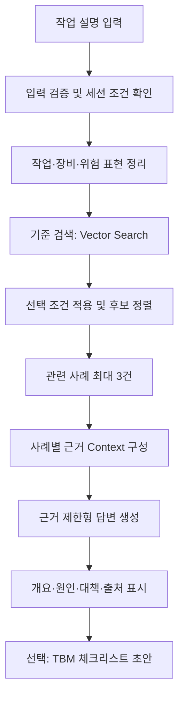
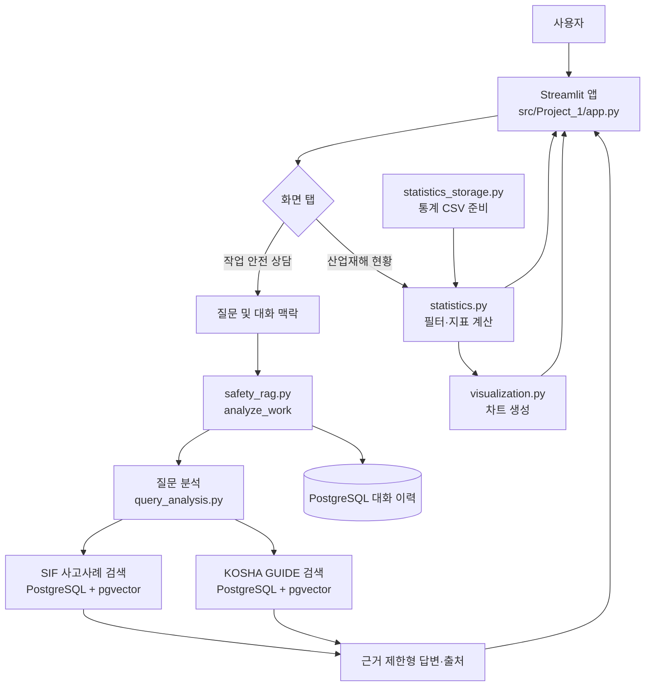

# 산업재해 유사사고 검색·TBM 지원 RAG 아키텍처

## 1. 프로젝트 요약

작업자가 수행할 작업을 입력하면 산업재해 사례에서 유사한 실제 사고를 검색하고, 사례의 재해개요·위험요인·위험성 감소대책을 출처와 함께 보여준다.

핵심은 **사고사례 검색과 근거 제시**다. 생성형 모델은 검색 근거를 요약·정리하며, 근거에 없는 사고 사실·법규·안전기준을 만들어내지 않는다.

## 2. MVP 흐름



## Project_1 통합 서비스 흐름

`src/Project_1/`은 RAG 검색에 통계 화면을 결합한 Streamlit 앱이다. 현재 구현은 질문을 자동 분류하는 Router가 아니라, 사용자가 선택하는 두 개의 탭으로 기능을 제공한다.



- `app.py`가 화면 탭, 통계 조건, 대화 세션, 사용자 입력과 결과 표시를 조정한다.
- 안전 상담은 `safety_rag.py`의 `analyze_work()`에서 시작한다. 내부적으로 `query_analysis.py`가 작업 맥락을 분석하고, SIF 사고사례와 KOSHA GUIDE를 각기 검색해 근거 유형을 구분한 답변을 구성한다.
- 통계 탭은 `statistics_storage.py`가 준비한 CSV를 `statistics.py`에서 읽고 조건별 KPI·비교·추세를 계산한다. `visualization.py`가 통계 차트를 만든다.
- 통계 CSV, 사례 벡터 컬렉션, 대화 이력은 서로 다른 데이터 경로다.
- 두 서비스 간 자동 질문 Router는 현재 구현에 없다. 기존 MVP의 단일 사례 검색 흐름과 이 통합 앱의 실제 화면 흐름을 구분해 이해한다.

## 3. 핵심 데이터

### SIF 사례 자료
- 제조업 등: 2,573건
- 건설업: 3,459건
- 합계: 6,032건의 사례 단위 문서 후보

초기 기준은 **사례 한 건 = 검색 문서 한 건**으로 유지한다.

### 주요 메타데이터
- `case_id`
- `source_file`
- `source_sheet`
- `source_row`
- `source_serial`
- 업종/건설 작업 분류
- `disaster_type`
- `object`
- `high_risk_work`
- `precursor`
- `control_measure`
- `embedding_text`

원문 값과 정규화 값은 구별해 저장하고, 원본에 없는 필드는 임의로 추정해 채우지 않는다.

## 4. 전처리 흐름

```text
원본 XLSX 보존
→ 시트/컬럼 탐색
→ 헤더와 사례 행 구분
→ 빈 사례·중복·필수 필드 점검
→ 원문 값 보존 및 정규화 값 생성
→ 안정적인 case_id 부여
→ 사례별 Document 생성
→ PostgreSQL + pgvector 적재
→ 행 수와 샘플 출처 검증
```

## 5. 기술 구성

- 언어·처리: Python, pandas/openpyxl
- 저장소·벡터 검색: PostgreSQL + pgvector
- 임베딩·LLM: 환경변수 기반 모델 설정
- 검색 기준선: pgvector 유사도 검색
- 검색 개선: Metadata Filter → Keyword + Vector Hybrid → Query Expansion → Reranking
- UI: Streamlit
- 비밀값: `.env`에서 관리

## 6. 검색·생성 규칙

1. 원 질의와 작업·장비·위험 표현을 기록한다.
2. 사용자가 명시한 조건만 hard filter에 적용한다.
3. 유사도 점수만으로 확정적인 안전판정을 내리지 않는다.
4. 재해개요, 재해유발요인, 위험성 감소대책을 구분한다.
5. 사례 ID와 원본 위치를 항상 함께 표시한다.
6. 원문 대책의 의미를 바꾸지 않는다.
7. 검색 자료에 없는 법령·기준값·위험도 점수를 생성하지 않는다.
8. 근거가 부족하면 한계를 표시한다.
9. TBM 출력은 현장 검토용 초안으로 표시한다.

## 7. 평가

### 평가 데이터
- 작업 상황 질문 30~50개
- 질문별 관련 `case_id` 수동 지정
- 개발용 질문과 최종 비교용 질문 분리

### 검색 지표
- Hit Rate@K / Recall@K
- MRR
- 명시적 업종·작업 조건 준수율
- 중복 사례 점검

### 실험 순서
```text
A. Vector baseline
B. Metadata + Vector
C. Keyword + Vector hybrid
D. Glossary query expansion
E. Reranking
```

한 번에 한 요소만 변경하고 같은 평가셋에서 비교한다.

## 8. 구현 순서

1. 원본 구조·이용조건 확인
2. 전처리 및 안정 ID/Metadata 생성
3. pgvector 기준 검색
4. 근거 제한형 RAG 답변
5. 평가셋 및 오류 분석
6. Agent 연결
7. Hybrid/확장/Reranking 비교
8. Streamlit 통합 데모 및 TBM 초안

## 9. 데이터 관리

- 원본과 가공 산출물을 분리한다.
- 사례마다 원본 파일·시트·행 위치를 유지한다.
- `.env` 및 비밀값을 저장소에 커밋하지 않는다.
- 이용조건 확인 전 원문·임베딩·Vector DB를 공개하지 않는다.
