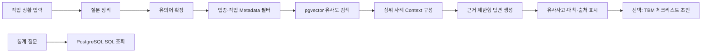

# 산업재해 유사사고 검색 및 TBM 지원 프로젝트 설계

기준 문서: `산업재해 RAG 프로젝트.docx`  
설계 기준일: 2026-09-28

## 1. 프로젝트 개요

현장 작업 정보를 입력하면 SIF 아카이브에서 유사한 실제 산업재해 사례를 찾아 원인과 위험성 감소대책을 보여주는 안전관리자용 RAG 서비스를 만든다. 검색된 사례는 작업 전 안전교육과 TBM 준비를 돕는 근거로 제공한다.

**핵심 기능은 유사 사고 검색이다.** 예방대책 요약과 TBM 체크리스트 초안은 검색 결과를 활용하는 후속 기능으로 둔다.

### 30초 프로젝트 설명

> 오늘 할 작업을 입력하면 과거 유사 산업재해와 그 원인·예방대책을 찾아 출처와 함께 보여주는 안전관리 지원 도구입니다.

## 2. 사용자와 입력

- **1순위 사용자:** 안전관리자 및 작업 전 교육 담당자
- **주요 사용 시점:** 작업 전 유사 사고 확인, 작업자 교육, TBM 준비
- **입력 방식:** 자유문장과 선택 항목 2~3개
- **입력 예:** `오늘 지붕 패널을 교체합니다` + 업종 `건설업` + 작업 `고소작업`

처음부터 여러 사용자 유형이나 복잡한 폼을 만들지 않는다. 작업 설명만으로 검색을 시작할 수 있고, 사용자가 업종·작업 조건을 추가하면 필터에 반영한다.

## 3. 범위와 기능 우선순위

### H3 필수 목표

1. 사용자가 작업 상황을 입력한다.
2. 관련 산업재해 사례를 검색해 최대 3건 보여준다.
3. 사례별 재해개요, 원인, 위험성 감소대책을 요약한다.
4. 각 내용에 사례 ID와 원본 시트·연번을 표시한다.

### M2 목표

데이터 수집·전처리, 문서 구성, 임베딩, pgvector 적재, metadata 필터, 유사도 검색, Context 구성, 근거 기반 답변 생성을 설명하고 재현할 수 있게 한다.

### M3 도전 과제

- 키워드 검색과 벡터 검색을 결합하는 Hybrid Search
- 용어사전 기반 Query Expansion
- 후보 문서 재정렬(Reranking)
- 검색 품질의 동일 평가셋 비교
- 후속 질문용 대화이력

### A1 확장

질문을 분류해 유사 사고·예방 질문은 RAG로, 사고건수·사망률 등 집계 질문은 SQL로 처리한다. H3/M2 시연이 안정된 다음 Router를 추가한다.

## 4. 데이터 설계

### 4.1 RAG 핵심 자료: SIF 아카이브 XLSX

파일: `한국산업안전보건공단_산업재해 고위험요인(SIF) 아카이브_20260401.xlsx`

| 시트 | 확인된 사례 수 | 주요 필드 |
|---|---:|---|
| 아카이브(제조업등) | 2,573 | 대·중·소 업종, 재해개요, 기인물, 고위험작업·상황, 재해유발요인, 위험성 감소대책 |
| 아카이브(건설업) | 3,459 | 공종, 작업명, 단위작업명, 재해종류, 재해개요, 기인물, 재해유발요인, 위험성 감소대책 |
| 합계 | 6,032 | 사례 한 건을 검색 문서 하나로 구성 |

건설업 시트는 분류용 다중 헤더를 가진다. pandas 점검에서 제조업 등 2,573건, 건설업 3,459건의 연번이 모두 존재하고 연번·전체 행 중복은 확인되지 않았다. 원본 파일은 변경하지 않고 보존하며, 적재 시 헤더 구조와 시트별 출처 행을 보존하고 필수 컬럼·결측을 재검증한다.

### 4.2 검색 보조 자료: 산업안전 용어사전 ZIP

ZIP에 유의어 사전 5,751행과 산업안전포털 검색어 사전 103행이 들어 있다. 이를 검색어 확장에 사용한다. 용어사전의 문구 자체를 사고 근거나 안전대책으로 제시하지 않는다.

포털 메타데이터에는 전체 행이 1로 표시되어 ZIP 내부 CSV 행 수와 차이가 있다. 설계·평가에서는 실제 파일을 기준으로 하되, 이 불일치를 출처 메모에 남긴다.

### 4.3 통계 자료는 별도 경로

산업중분류·규모별 사고재해자수, 사고사망자수, 사업장수, 사망만인율 CSV는 통계 대시보드 및 SQL 조회에 사용한다. 사고사례 벡터 DB에는 넣지 않는다.

고용노동부 AI친화 학습데이터 CSV는 재해조사보고서·중대재해 사이렌 등의 공개 경로 목록이다. 사고 원문이 확보되고 이용 조건을 확인한 뒤 후속 코퍼스로 검토한다.

## 5. 검색 문서와 Metadata

### 문서 단위

초기에는 사례 한 건을 문서 하나로 유지한다. 사례 요약·위험요인·감소대책이 한 문서에 함께 있어야 검색 결과만 보고 사고 맥락과 대책을 연결할 수 있다. 필요성이 확인되기 전에는 청크를 더 쪼개지 않는다.

### 본문 예시

```text
재해개요: 작업자가 컨베이어 점검 중 벨트 사이에 끼여 사망
기인물: 컨베이어
고위험작업·상황: 비정형 작업(점검)
재해유발요인: 안전장치 미설치 또는 해제 상태에서 설비 사용
위험성 감소대책: 방호울과 비상정지장치 설치
```

### 권장 Metadata

| 필드 | 설명 |
|---|---|
| `case_id` | 시트명과 원본 연번으로 만든 안정적 ID |
| `industry_major`, `industry_mid`, `industry_small` | 원본에 존재하는 업종 분류 |
| `construction_work`, `construction_task`, `unit_task` | 건설업 공종·작업 분류 |
| `disaster_type` | 건설업 시트의 재해종류 등 원본 명시 필드 |
| `object` | 기인물 원문 |
| `high_risk_work` | 고위험작업·상황 원문 |
| `source_file`, `source_sheet`, `source_row` | 출처 추적 정보 |

원본에 명시되지 않은 업종·재해유형을 임의 추정해 필터 값으로 만들지 않는다. 제조업 등 시트와 건설업 시트의 구조 차이는 원본 구분을 보존한다.

## 6. 시스템 아키텍처



### 권장 기술 구성

- **애플리케이션:** Python
- **데이터베이스:** PostgreSQL
- **벡터 검색:** pgvector
- **임베딩·답변 모델:** 기존 `src/sif_rag/` 설정을 우선 재사용
- **UI:** H3에서는 단일 입력·결과 화면, 이후 Streamlit 등으로 확장

PostgreSQL을 사용하는 이유는 사례 Metadata 필터와 벡터 검색을 함께 처리하고, 이후 통계 SQL 경로와 데이터 저장 기반을 공유하기 위해서다.

## 7. 검색·답변 규칙

1. 작업 설명에서 업종, 작업, 장비·기인물, 위험 상황을 추출한다.
2. 사용자가 지정한 값은 필터에 적용하고, 불확실한 값은 검색 조건으로 강제하지 않는다.
3. 원 질의와 용어사전 확장 질의의 검색 결과를 결합한다.
4. 관련 사고 최대 3건을 보여주고, 재해개요·원인·감소대책을 사례별로 분리한다.
5. LLM은 검색된 근거를 요약한다. 원문에 없는 법규 해석, 안전기준, 대책을 만들어내지 않는다.
6. TBM 체크리스트는 검색된 대책을 작업 전 확인 문장으로 바꾼 초안으로 표시하고, 현장 담당자의 검토를 안내한다.
7. 근거가 부족하면 관련 사례를 찾지 못했거나 근거가 부족하다고 답한다.

## 8. 평가 계획

### 검색 평가셋

질문 30~50개를 만들고, 각 질문마다 관련 사례 ID를 사람이 지정한다. 데이터 분할은 개발 질문과 최종 확인 질문으로 나눠 개선 과정에서 최종 확인 질문을 반복 튜닝에 사용하지 않는다.

### 검색 지표

- Hit Rate@K / Recall@K
- MRR
- 업종·작업 필터가 지정된 질문의 검색 정확도

### 답변 검토 항목

- 답변의 각 사고 사실이 검색 문서에 근거하는가
- 인용한 사례 ID가 실제로 표시된 내용과 일치하는가
- 감소대책이 원문 의미를 보존하는가
- 근거가 없을 때 답변을 보류하는가

Vector 검색 기준선을 먼저 측정한 뒤 Metadata+Vector, Hybrid, Reranking 순으로 한 가지씩 추가하고 같은 평가셋에서 비교한다.

## 9. 데모 시나리오

1. 사용자: `오늘 물류창고에서 지게차로 철제 자재를 하역합니다.`
2. 서비스: 유사사고 3건, 각 사고의 개요·기인물·원인·감소대책과 출처를 제시한다.
3. 사용자: `끼임 사고만 보여줘.`
4. 서비스: 기존 검색 조건을 유지하면서 끼임 관련 사례를 다시 보여준다.
5. 사용자: `예방대책을 TBM 체크리스트로 만들어줘.`
6. 서비스: 검색된 사례의 대책만 근거로 체크리스트 초안을 만들고 출처를 표시한다.

## 10. 단계별 완료 기준

| 단계 | 산출물 | 완료 기준 |
|---|---|---|
| 데이터 준비 | SIF 로더와 품질 요약 | 두 시트의 사례 수와 출처 ID 검증 |
| H3 | 검색·답변 UI | 유사사고 검색, 근거 대책, 출처 표시가 한 흐름으로 동작 |
| M2 | 설명 가능한 RAG 파이프라인 | 전처리부터 검색·답변까지 재현하고 설명 가능 |
| M3 | 검색 품질 개선 비교 | Vector, Metadata+Vector, Hybrid 등의 같은 평가셋 결과 |
| A1 | RAG/SQL Router | 질문 유형에 따라 사례 검색 또는 통계 SQL 실행 |

팀 작업을 나누면 데이터 적재, 검색·평가, UI·시연을 각각 독립 산출물로 관리하고, 통합 시 `case_id`, 검색 결과 schema, 답변 근거 형식을 계약으로 맞춘다.

## 11. 이용조건과 운영상 주의

SIF XLSX 포털 페이지에는 출처표시·변경금지 및 2차 저작물 작성 금지 조건이 표시되어 있다. 원본을 보존하고 모든 사례에 출처를 연결한다. 임베딩, 정제본, 벡터 DB 또는 이를 포함한 앱을 외부에 배포하기 전에는 이용허락 범위를 확인한다.

로컬 XLSX를 읽는 데 공공데이터포털 API 키는 필요하지 않다. 기존 노트북의 OpenAI 임베딩·LLM 호출을 사용하면 `OPENAI_API_KEY`와 모델 비용이 발생할 수 있고, PostgreSQL 연결 설정이 별도로 필요하다. 이 키들은 공공데이터 다운로드 키와 구분한다.

## 12. 참고 자료

- 프로젝트 기준 문서: `산업재해 RAG 프로젝트.docx`
- SIF 아카이브: https://www.data.go.kr/data/15140383/fileData.do
- 산업현장 법률용어 정의 데이터: https://www.data.go.kr/data/15161288/fileData.do
- 사고재해자수: https://www.data.go.kr/data/15084672/fileData.do
- 산업중분류별 사고사망자수: https://www.data.go.kr/data/15084674/fileData.do
- 사업장수: https://www.data.go.kr/data/15064487/fileData.do
- 사망만인율: https://www.data.go.kr/data/15064491/fileData.do
- AI친화 사고정보·예방조치 데이터: https://www.data.go.kr/data/15162988/fileData.do
