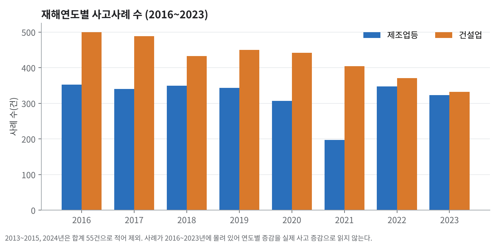
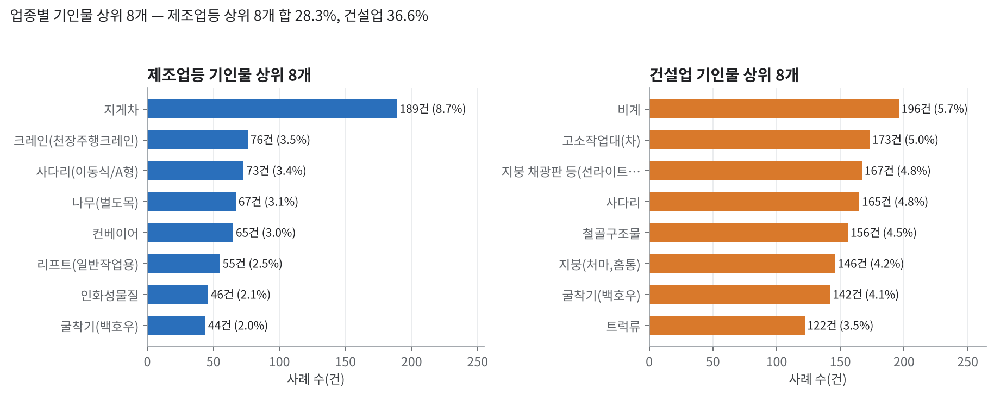
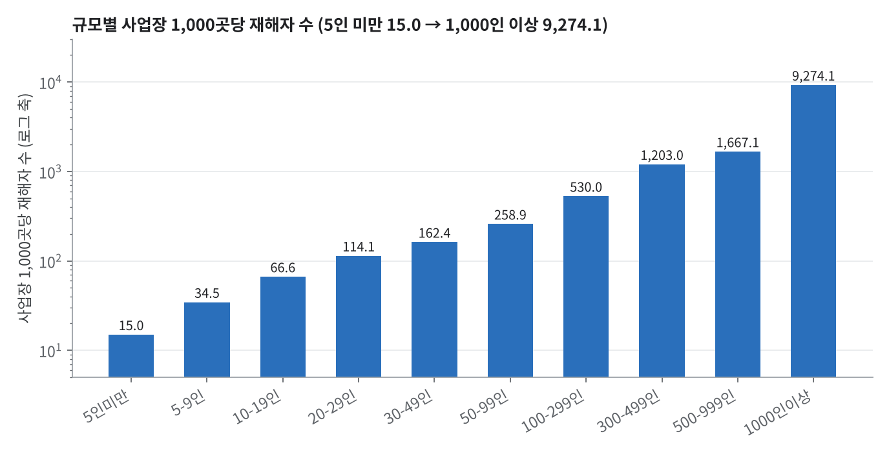
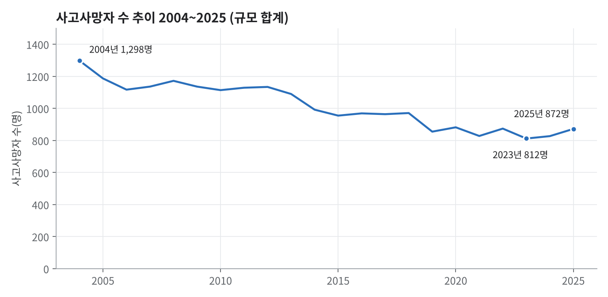

# 분석 보고서 (EDA · 통계 검정 · TF-IDF)

작성: 송수림 · 2026-10-07 · 분석 대상: SIF 사고사례 6,032건(제조업등 2,573 + 건설업 3,459)과 통계 4개

이 보고서의 숫자는 모두 실행 결과다. 1~3절은 `03_m3_기술통계분석.ipynb`의 실행 결과이고, 4~5절의 통계 검정 일부와 TF-IDF는 같은 전처리 파일(`data/processed`)로 이 보고서를 쓰면서 추가로 실행한 결과다.

## 1. 분석 질문과 결론

| 질문 | 결론 |
|---|---|
| 업종마다 사고를 일으킨 물체(기인물)가 다른가? | 다르다. 제조업등은 여러 기인물에 나뉘고(상위 8개 28.3%), 건설업은 소수에 모인다(상위 8개 36.6%). 업종과 기인물은 통계적으로 연관된다(카이제곱 p < 0.001, Cramér's V = 0.46) |
| 사고 서술 문장에도 업종 차이가 있는가? | 있다. 제조업등은 `끼임·지게차·설비·점검·폭발·컨베이어`, 건설업은 `추락·지상·콘크리트·작업발판·거푸집` 같은 단어가 두드러진다(TF-IDF) |
| 규모가 클수록 사고가 많은가? | 사업장 수와 재해자 수는 함께 커진다(Spearman 0.751). 사업장 1,000곳당 재해자 수는 5인 미만 15.0명에서 1,000인 이상 9,274.1명으로 커진다 |
| 사고는 줄고 있는가? | 사고사망자는 2004년 1,298명에서 2025년 872명으로 426명(32.8%) 줄었다 |

이 결론이 RAG를 만든 이유다. 통계 숫자만으로는 사고가 어떻게 일어났고 어떻게 막을 수 있는지 알 수 없으므로, 현재 작업과 비슷한 과거 사례를 찾아 원인과 예방대책을 보여 주는 검색이 필요했다. 업종과 기인물 구분이 의미 있다는 것을 확인했기 때문에 업종·연도를 검색 필터로 쓴다.

## 2. 기술통계

### 2-1. 사고사례 (1번)

| 업종구분 | 건수 | 기인물 종류 수 | 기인물 결측(분류 불가) | 재해연도 범위 | 재해개요 평균 글자 수 |
|---|---|---|---|---|---|
| 제조업등 | 2,573 | 625 | 398 (15.5%) | 2014~2023 | 90 |
| 건설업 | 3,459 | 57 | 0 | 2013~2024 | 107 |

- 사례 연도는 2016~2023년에 집중되어 있고 나머지 연도는 매우 적다. 연도별 증감을 실제 사고 증감으로 해석하지 않는다.

### 2-2. 통계표 (2·4·5번, 업종 30개 × 규모 10개)

| 표 | 결측 | 최소 | 중앙값 | 최대 |
|---|---|---|---|---|
| 2번 재해자수 | 0칸 | 0 | 69 | 8,406 |
| 4번 사업장수 | 0칸 | 0 | 257.5 | 804,274 |
| 5번 사망만인율 | 14칸 | 0.00 | 0.30 | 8,333.33 |

- 5번의 결측 14칸은 모두 4번 사업장수가 0인 칸이다(14/14). 사업장이 없어 비율을 계산할 수 없는 칸이므로 0으로 채우지 않았고, 확인 요망으로 표기한다.
- 사망만인율의 극단값(최대 8,333.33)은 규모가 매우 작은 업종에서 사망 1건이 비율을 크게 키우는 구조의 값이다. 삭제하지 않고 따로 표기한다.

## 3. 분포와 비교

### 3-1. 기인물 상위 8개 (업종별)

기인물이 확인된 사례 중 건수 순위다(제조업등의 `분류 불가` 398건 제외).

| 순위 | 제조업등 | 건수 | 비중 | 건설업 | 건수 | 비중 |
|---|---|---|---|---|---|---|
| 1 | 지게차 | 189 | 8.7% | 비계 | 196 | 5.7% |
| 2 | 크레인(천장주행크레인) | 76 | 3.5% | 고소작업대(차) | 173 | 5.0% |
| 3 | 사다리(이동식/A형) | 73 | 3.4% | 지붕 채광판 등(선라이트, 슬레이트) | 167 | 4.8% |
| 4 | 나무(벌도목) | 67 | 3.1% | 사다리 | 165 | 4.8% |
| 5 | 컨베이어 | 65 | 3.0% | 철골구조물 | 156 | 4.5% |
| 6 | 리프트(일반작업용) | 55 | 2.5% | 지붕(처마,홈통) | 146 | 4.2% |
| 7 | 인화성물질 | 46 | 2.1% | 굴착기(백호우) | 142 | 4.1% |
| 8 | 굴착기(백호우) | 44 | 2.0% | 트럭류 | 122 | 3.5% |
| | 상위 8개 합계 비중 | | 28.3% | | | 36.6% |

### 3-2. 규모별 사업장 1,000곳당 재해자 수

| 규모 | 재해자 수 합계 | 사업장 수 합계 | 1,000곳당 재해자 수 |
|---|---|---|---|
| 5인 미만 | 36,034 | 2,394,576 | 15.0 |
| 5~9인 | 13,966 | 404,245 | 34.5 |
| 10~19인 | 14,837 | 222,942 | 66.6 |
| 20~29인 | 8,411 | 73,707 | 114.1 |
| 30~49인 | 8,934 | 55,019 | 162.4 |
| 50~99인 | 8,721 | 33,688 | 258.9 |
| 100~299인 | 9,365 | 17,669 | 530.0 |
| 300~499인 | 3,277 | 2,724 | 1,203.0 |
| 500~999인 | 2,554 | 1,532 | 1,667.1 |
| 1,000인 이상 | 7,206 | 777 | 9,274.1 |

### 3-3. 사고사망자 추이 (3번, 2004~2025)

2004년 1,298명, 최저 2023년 812명, 2025년 872명. 2004년 대비 2025년은 426명(32.8%) 감소했다.

## 4. 통계 검정

### 4-1. 사업장 수와 재해자 수의 상관 (Spearman)

- 대상: 업종 × 규모 조합 중 사업장 수가 0이 아닌 286칸(전체 300칸에서 사업장이 없는 14칸 제외)
- 결과: Spearman ρ = 0.751, p = 3.3 × 10⁻⁵³
- 전체 300칸으로 계산하면 ρ = 0.783이다.
- 해석: 사업장 수가 많은 칸일수록 재해자 수도 많다. 이것은 상관이고, 규모가 클수록 위험하다는 인과가 아니다. 규모를 맞춘 비교는 3-2의 1,000곳당 재해자 수로 한다.

### 4-2. 업종과 기인물의 연관 (카이제곱 독립성 검정)

- 대상: 기인물이 확인된 5,634건. 전체에서 많은 기인물 10개와 나머지를 묶은 `기타`, 두 업종을 비교했다.
- 결과: χ² = 1,191.0, 자유도 10, p < 10⁻²⁴⁰, Cramér's V = 0.46 (기대 빈도 최소 46.7)
- 해석: 업종에 따라 기인물 분포가 크게 다르다. 예를 들어 비계·고소작업대·철골구조물은 건설업에서만, 지게차는 제조업등에서 압도적(189건 대 27건)으로 나온다.
- 주의: 상위 10개를 데이터에서 골랐으므로 p값은 참고용이고, 효과 크기(V)와 건수 표를 함께 봐야 한다. 이 검정은 업종·기인물을 검색 필터로 쓰는 근거다.

## 5. TF-IDF (사고 서술 문장에서 업종별로 더 자주 나오는 단어)

- 대상: 사례의 `재해개요` 6,032건. 단어마다 TF-IDF(문장 안 빈도를 문서 전체에서 흔한 정도로 보정한 값)를 계산했다.
- 뽑는 방법: 한 업종의 TF-IDF 평균이 높은 순으로 보되, **그 업종 사례 40건 이상에 나오고, 다른 업종보다 3배 이상 자주 나오는 단어**만 남겼다. 평균 점수 차이만으로 고르면 `사이`, `머리`처럼 어느 업종에도 흔한 단어가 올라오기 때문이다.
- 전처리: 한글 두 글자 이상 단어, 조사는 간단한 규칙으로 제거(형태소 분석기는 쓰지 않음), 같은 뜻의 변형은 하나로 합침(`끼어`·`끼여`→`끼임`, `떨어져`→`떨어짐`). 10건 미만 등장 단어와 40% 넘는 문서에 나오는 단어 제외, 로그 TF. 어휘 1,142개.
- 표의 비율은 "그 업종 사례 중 이 단어가 나온 사례의 %"다.

### 제조업등

| 순위 | 단어 | 나온 사례 수 | 이 업종 비율 | 다른 업종 비율 | 배수 |
|---|---|---|---|---|---|
| 1 | 끼임 | 527 | 20.5% | 3.2% | 6.1배 |
| 2 | 공장 | 413 | 16.1% | 1.7% | 8.9배 |
| 3 | 지게차 | 237 | 9.2% | 1.3% | 6.7배 |
| 4 | 작업장 | 174 | 6.8% | 0.7% | 8.5배 |
| 5 | 설비 | 131 | 5.1% | 0.5% | 8.6배 |
| 6 | 점검 | 136 | 5.3% | 0.8% | 6.0배 |
| 7 | 폭발 | 113 | 4.4% | 0.4% | 9.2배 |
| 8 | 컨베이어 | 92 | 3.6% | 0.4% | 7.5배 |
| 9 | 화상 | 120 | 4.7% | 0.8% | 5.5배 |
| 10 | 화재 | 101 | 3.9% | 0.7% | 4.8배 |
| 11 | 제품 | 86 | 3.3% | 0.0% | 33.4배 |
| 12 | 선박 | 74 | 2.9% | 0.1% | 18.2배 |

### 건설업

| 순위 | 단어 | 나온 사례 수 | 이 업종 비율 | 다른 업종 비율 | 배수 |
|---|---|---|---|---|---|
| 1 | 바닥 | 1491 | 43.1% | 13.2% | 3.2배 |
| 2 | 지상 | 704 | 20.4% | 0.8% | 22.2배 |
| 3 | 추락 | 876 | 25.3% | 7.2% | 3.5배 |
| 4 | 콘크리트 | 554 | 16.0% | 2.0% | 7.6배 |
| 5 | 중심 | 539 | 15.6% | 4.2% | 3.6배 |
| 6 | 설치 | 466 | 13.5% | 3.2% | 4.1배 |
| 7 | 작업발판 | 263 | 7.6% | 1.3% | 5.5배 |
| 8 | 지하 | 232 | 6.7% | 1.6% | 4.0배 |
| 9 | 고소작업대 | 186 | 5.4% | 1.4% | 3.7배 |
| 10 | 거푸집 | 188 | 5.4% | 0.2% | 18.5배 |
| 11 | 개구부 | 206 | 6.0% | 1.7% | 3.3배 |
| 12 | 해체 | 227 | 6.6% | 1.7% | 3.7배 |

- 해석: 제조업등은 설비에 끼이는 사고(`끼임` 20.5%, 다른 업종 3.2%)와 `지게차`·`컨베이어`·`설비`·`점검` 중 사고, `폭발`·`화재`·`화상`이 두드러진다. 건설업은 높은 곳에서 떨어지는 사고(`추락`·`작업발판`·`개구부`·`고소작업대`)와 `콘크리트`·`거푸집`·`해체` 같은 공정 단어가 두드러진다. 3-1의 기인물 결과와 같은 방향이다.
- 한계: 이 표에는 업종 특징이라기보다 일반 단어에 가까운 것(`공장`, `작업장`, `바닥`, `중심`, `설치`, `제품`)도 남아 있다. 두 업종의 작업 장소와 서술 방식 차이를 보여 줄 뿐이라, 사고 유형의 근거로는 `끼임`·`지게차`·`폭발`·`추락`·`거푸집`처럼 사고와 직접 관련된 단어만 본다. 형태소 분석기를 쓰지 않았으므로 참고용이다.

## 6. 한계

- 사례는 대부분 2016~2023년 자료라 연도별 증감을 실제 사고 증감으로 읽을 수 없다.
- 제조업등 기인물 398건(15.5%)은 `분류 불가`라 기인물 분석에서 제외했다.
- 통계표(2·4·5번)는 업종 × 규모 요약이라 사고사례와 같은 사고를 가리키지 않는다.
- 상관과 연관 검정은 인과를 보여 주지 않는다.

## 7. RAG로 이어진 부분

| 분석에서 알게 된 것 | RAG에 반영한 것 |
|---|---|
| 업종마다 기인물·사고 유형이 다르다 | 업종·연도를 검색 필터(`where`)로 사용 |
| 통계만으로는 원인·대책을 알 수 없다 | 사례 본문과 감소대책을 근거로 답변 |
| 사례 연도가 일부 연도에 몰려 있다 | 연도 필터를 쓸 때 범위 안 사례만 근거로 표시 |
