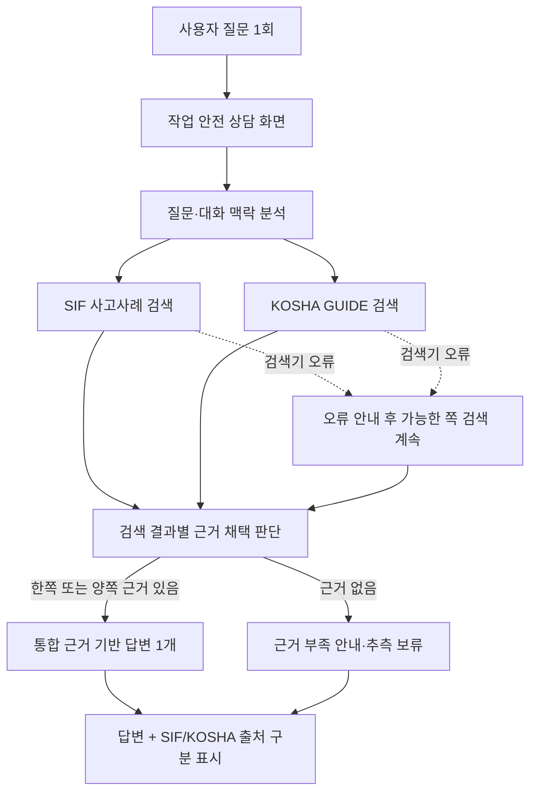

# 통합 산업안전 앱 골든셋 평가 시나리오

## 기준 앱과 평가 범위

기준은 로컬 `main`의 `src/Project_1/app.py` 및 `src/Project_1/services/safety_rag.py` 흐름이다. 사용자는 작업 안전 상담 화면에 질문을 한 번 입력한다. 상담 서비스는 한 질문을 SIF 사고사례 검색과 KOSHA GUIDE 검색에 전달하고, 검색된 근거를 함께 사용해 답변 하나를 만든다. 통계 화면은 별도 탭이며 챗봇이 통계 질문을 처리하는 Router는 현재 범위에 없다.

사용자가 선택하는 직접 검색 경로는 골든셋 사용자 시나리오에 넣지 않는다. 검색기별 비교는 동일한 질문·라벨·코퍼스 기준으로 내부 평가에서 하고, 통합 상담 경로의 답변 품질은 별도 루브릭으로 평가한다.

## 질문 1회 처리 흐름

## 평가 시나리오와 순서

| 순서 | ID | 구분 | 입력 | 평가 기준 | 기대 근거 ID / 사람 검토 |
|---:|---|---|---|---|---|
| 1 | S01 | 통합 경로·답변 품질 | “굴착기 후진 중 작업자 충돌·깔림 사고를 예방하려면 무엇을 확인해야 하나요?” | 한 번의 질문에서 SIF와 KOSHA가 모두 검색되는지, 답변 하나에서 사고 근거와 안전기준 근거를 출처별로 구분하는지 확인한다. 검색 후보와 최종 채택 근거를 혼동하지 않는다. | SIF 사례 ID와 GUIDE ID 연결 필요. 사람 검토 전 `candidate`. |
| 2 | S06 | 답변 품질·보류 | “검색된 사고사례와 안전지침에 법 조항이 확인되지 않으면, 이 작업이 법적으로 의무인지 알려주세요.” | 검색 자료에 없는 법적 의무·조항을 단정하지 않고, 근거 범위와 법률 해석의 한계를 밝히는지 확인한다. | 관련 근거 ID 또는 사람이 확인한 근거 부재 조건이 필요. 사람 검토 전 `candidate`. |
| 3 | S03 | 검색 관련성·답변 품질 | “창고에서 지게차와 보행자의 충돌을 막으려면 동선과 작업을 어떻게 통제해야 하나요?” | 단순히 지게차가 등장하는 문서가 아니라 보행자 충돌 메커니즘에 직접 맞는 SIF·KOSHA 근거를 선별하는지 확인한다. | SIF 사례 ID와 GUIDE ID 연결 필요. 사람 검토 전 `candidate`. |
| 4 | S04 | 대화 기능 회귀 | 1턴: “굴착기 후진 중 작업자 충돌을 예방하려면?” 2턴: “작업 시작 전에 특히 뭘 확인해야 해?” | 후속 질문에서 굴착기 후진이라는 작업 맥락을 유지하고, 이전 근거의 재사용 또는 갱신이 진단 정보와 맞는지 확인한다. 검색 랭킹 점수에는 넣지 않는다. | 질문·기대 주제·회귀 기준을 검토. 골든 검색 라벨 아님. |
| 5 | S05 | 대화 기능 회귀 | 1턴: “굴착기 작업 안전은?” 2턴: “목재 절단 작업에서 주의할 점은?” | 새 작업 질문에 앞선 굴착기 근거를 잘못 재사용하지 않는지 확인한다. 검색 랭킹 점수에는 넣지 않는다. | 질문·기대 주제·회귀 기준을 검토. 골든 검색 라벨 아님. |
| 별도 | S07 | 오류 주입 회귀 | 동일한 상담 질문에서 SIF 검색 또는 KOSHA 검색 중 한쪽을 강제로 실패시킨다. | 실패한 쪽의 오류를 알리고 가능한 쪽의 검색 근거는 보존해 답변에 사용한다. 실패를 성공으로 표시하거나 양쪽 근거가 모두 있는 것처럼 답하지 않는다. | 주입한 오류 종류와 남은 근거 ID를 테스트 fixture에 기록. |
| 별도 | S08 | 인용 무결성 회귀 | 검색 후보에 없는 사례 ID 또는 다른 GUIDE ID를 답변 인용으로 넣도록 생성 결과를 주입한다. | 답변에서 잘못된 출처가 표시되지 않도록 검증·차단하고, 출처 링크와 ID가 실제 전달된 근거에 연결되는지 확인한다. | 허용 근거 ID와 주입한 잘못된 인용을 fixture에 기록. |
| 보류 | S02 | 근거 확인 후 결정 | “밀폐공간 재해자를 구조할 때 구조자의 2차 질식을 막으려면 어떻게 해야 하나요?” | 자료에서 구조자 보호에 직접 해당하는 사례·지침을 먼저 확인한다. 근거가 확인되면 그 근거 범위에서 평가하고, 없으면 추측하지 않고 보류하는지 본다. | 자료 검토와 기대 SIF/GUIDE ID 연결 전 골든셋에 포함하지 않는다. |

통계 질문은 상담 경로 평가에서 제외한다. 앱에는 별도 통계 탭이 있지만 챗봇의 통계 라우팅 기능은 구현 범위가 아니다. 통계를 챗봇에서 처리하게 되면 별도 질문 의도와 수치 정답 기준으로 새 평가를 설계한다.

## 골든셋 문항 스키마와 승인 기준

각 확정 문항에는 아래 정보를 둔다. 자연어 정답 한 문장을 고정하기보다 허용 가능한 답변 기준과 금지 주장을 기록한다.

- `scenario_id`, `question_id`, `question`, `turns`, `intent`
- `expected_sif_evidence_ids`, `expected_kosha_evidence_ids` (근거가 없다고 사람 검토된 경우는 빈 배열과 사유를 기록)
- `allowed_answer_criteria`, `forbidden_claims`
- `source_reference`, `rationale`, `reviewer`, `human_review_status`
- `corpus_snapshot`, `app_revision`, `evaluation_split`

사람 검토와 출처 연결이 완료되지 않은 문항은 `candidate` 또는 `HOLD`로 두고 골든셋 지표에서 제외한다. S04·S05·S07·S08은 검색 품질 gold가 아니라 대화·오류·인용 회귀 테스트로 별도 실행한다.

## 지표 분리

1. **검색기 내부 비교:** 같은 질문, 같은 코퍼스 스냅샷, 같은 필터 및 top-k 후보 풀에서 SIF와 KOSHA를 각각 평가한다. 각 자료 유형에 맞는 기대 ID로 Hit@k/MRR을 계산한다. 미지원 자료 유형은 0점 대신 `N/A`다. 순위 깊이보다 큰 k 지표는 내지 않는다.
2. **통합 상담 답변:** S01·S03·S06을 중심으로 근거 충실성, 출처 ID 정확도, 출처 유형 구분, 금지 주장 여부, 근거 부족 시 보류를 사람 루브릭으로 평가한다. 검색 지표와 합산하지 않는다.
3. **회귀 테스트:** S04·S05·S07·S08은 대화 상태·부분 검색 실패·인용 일치 동작을 검증한다. 이 결과를 검색 품질 수치로 부르지 않는다.

## 현 상태

- 평가 실행 순서: **S01 → S06 → S03 → S04 → S05**
- S07·S08: 오류 주입 회귀 항목 추가, 구현 검증 필요
- S02: 구조자 보호 근거 확인 전 보류
- 기대 근거 ID 연결 및 사람 검토: 미완료
- 확정 골든셋: 없음. 위 항목은 승인 전 시나리오 정의다.

## 단일 상담 화면 목표 설계 (2026-10-05 개정)

기존 시나리오의 기준(main 상담에서 항상 양쪽 검색)은 현재 구현을 설명한다. 이번 목표 설계는 화면을 단일 상담창으로 통합하고, 질문 의도에 따라 검색기를 내부 라우팅하는 구조다. 목표 구현 전까지는 아래 기대 검색 대상을 목표 기준으로 취급하며 현재 main의 동작으로 보고하지 않는다.

| 시나리오 | 의도·위험 메커니즘 | 목표 기대 검색 대상 |
|---|---|---|
| S01 | 굴착기 후진 충돌·깔림 예방 | SIF + KOSHA |
| S06 | 법적 의무 여부, 근거 없는 법률 단정 방지 | 양쪽 (모호·고위험 보수 라우팅) |
| S03 | 지게차와 보행자 충돌 예방 | SIF + KOSHA |
| S04 | 후속 질문, 굴착기 후진 작업 맥락 유지 | 매 턴 재판정, 불명확하면 양쪽 |
| S05 | 목재 절단 새 주제로 전환 | 새 질문 의도에 맞게 재판정, 불명확하면 양쪽 |
| S02 | 밀폐공간 구조자 2차 질식 방지 | 양쪽; 근거 확인 전 정식 평가 보류 |
| S09 (라우팅 후보) | 유사 사고사례 조회 | SIF |
| S10 (라우팅 후보) | 안전 기준·작업 절차 조회 | KOSHA |

각 문항에 질문 의도, 위험 메커니즘, `expected_retrieval_targets` (SIF/KOSHA/BOTH), 기대 근거 ID, 허용 답변 기준, 반드시 포함할 안전 통제, 금지 주장, 근거 부족 시 기대 동작, 출처, 검토자, 검토 상태를 기록한다. 기대 검색 대상과 실제 호출 라우팅, 근거 검색·적합성, 최종 답변 품질은 각각 별도 판정·보고한다. 근거 ID 연결과 사람 검토가 끝난 문항만 골든셋으로 승인한다.

S07은 목표 검색 대상 중 한쪽 검색 실패를, S08은 검색 결과에 없는 출처 ID 인용을 회귀 주입한다. 실제 근거만 출처별로 표시하고, 남은 근거가 부족하면 답변을 보류한다. S04/S05/S07/S08은 검색 품질 점수와 분리한다. 평가 순서는 S01 → S06 → S03 → S04 → S05를 유지한다. 통계는 현재 별도 화면이므로 챗봇 골든셋에서 제외한다. PR #14의 자료·산출물은 후보 생성이나 평가에 사용하지 않는다.

목표 내부 라우팅은 유사 사고사례 질문에 SIF, 기준·절차 질문에 KOSHA, 예방·위험 분석 질문에 양쪽을 검색한다. 의도가 모호하거나 안전조치 누락 위험이 있으면 양쪽을 검색한다. 사용자에게 검색 방식을 선택하게 하지 않으며, 한 질문에 답변 하나를 제공하고 SIF/KOSHA 근거를 출처별로 나눈다.
