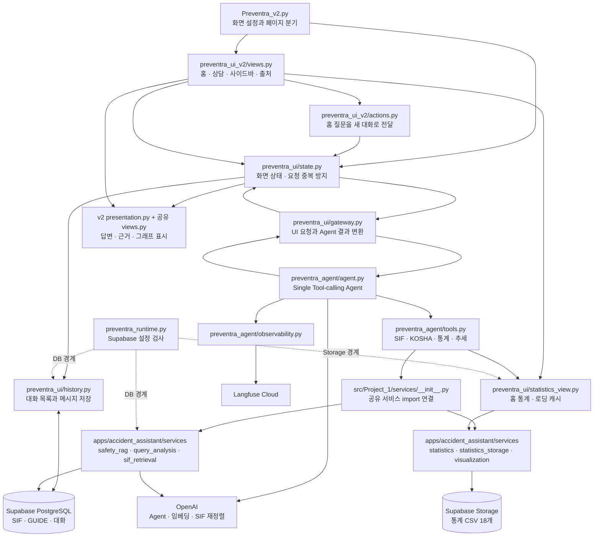
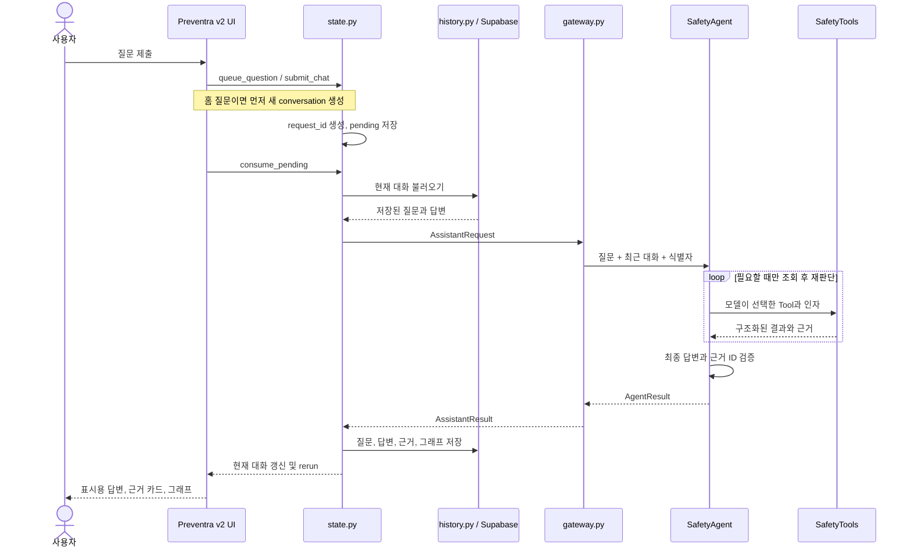
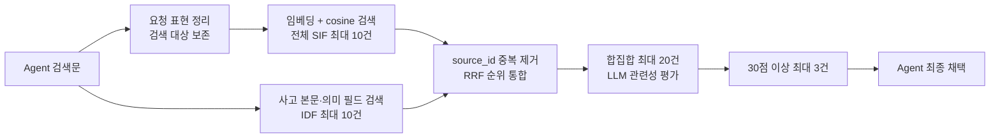

# Preventra v2 실행 구조와 파일별 역할



**Preventra v2는 화면, 대화 상태, Agent, 재사용 서비스, 외부 저장소를 나눈 Streamlit 앱이다.** 메인 파일이 모든 로직을 실행하는 대신 화면을 선택하고, 사용자 질문은 상태 관리 모듈을 거쳐 Agent에 전달된다. Agent는 필요한 Tool만 호출하고 결과를 다시 읽어 답변한다.

기준 코드는 `feature/preventra-integrated-ui`의 `6abb090`이며, 검색 개선과 인용 표시 정리까지 포함한다. 아래 경로는 저장소 루트 기준이다. 표의 “주요 구성”은 이 진입점에서 사용하는 함수·모델을 중심으로 정리했으며, 사용하지 않는 기존 앱 기능은 별도로 구분했다.

## 1. 메인 파일과 화면 계층

기본 경로: `src/Project_1/`

| 파일 | 역할 | 주요 구성과 연결 |
| --- | --- | --- |
| [Preventra_v2.py](Preventra_v2.py) | 앱 진입점 | `main()`에서 페이지 설정 → `state.initialize()` → 스타일·사이드바·헤더 → 현재 페이지 렌더링 순으로 실행한다. 상담 화면에서는 하단 `st.chat_input`을 만들고 `state.submit_chat`에 연결한다. 입력 한도는 4,000자다. |
| [preventra_ui_v2/views.py](preventra_ui_v2/views.py) | v2 화면 조립 | `apply_style`, `render_header`, `render_home`, `render_sidebar`, `render_assistant`, `render_sources`, `render_source_notice`. 홈 소개·질문창·예시 버튼·최근 대화 목록을 구성한다. 공유 통계 화면과 결과·출처 렌더러를 재사용한다. |
| [preventra_ui_v2/actions.py](preventra_ui_v2/actions.py) | 홈에서 질문 시작 | `submit_home()`이 입력을 읽고 `start_from_home()`을 호출한다. 빈 입력·진행 중 요청을 확인한 후 `state.new_chat()` → `state.queue_question()`을 수행한다. 대화 생성 실패 시 질문을 넘기지 않는다. |
| [preventra_ui_v2/presentation.py](preventra_ui_v2/presentation.py) | 표시용 답변 가공 | `without_reference_tokens()`가 SIF·GUIDE·STATS 인용 토큰을 숨긴다. `for_display()`는 `dataclasses.replace`로 답변·통계 설명의 표시 복사본을 만든다. DB에 저장된 원문과 Agent의 근거 ID는 수정하지 않는다. |
| [preventra_ui_v2/styles.css](preventra_ui_v2/styles.css) | v2 전용 스타일 | 홈 예시 질문, 헤더, 최근 대화 강조, 사용자 오른쪽 말풍선, 답변 왼쪽 배치, 입력창 너비, 출처 안내, 모바일·focus 상태를 정의한다. v2 컨테이너에 범위를 한정하며 글자수 카운터만 시각적으로 숨긴다. |
| [preventra_ui_v2/run_app.py](preventra_ui_v2/run_app.py) | 선택 실행 도구 | 별도 테마 폴더를 작업 디렉터리로 삼아 Streamlit을 실행한다. 기본 주소는 `127.0.0.1:8515`이며 추가 실행 인자를 전달할 수 있다. |
| [preventra_ui_v2/theme/.streamlit/config.toml](preventra_ui_v2/theme/.streamlit/config.toml) | 선택 실행용 공식 테마 | 밝은 배경, 청록 포인트, 글꼴·모서리·사이드바 설정. 이 폴더에서 실행하는 launcher 사용 시 적용된다. `Preventra_v2.py` 직접 실행이 이 중첩 설정을 자동으로 읽는 것은 아니다. |
| [preventra_ui_v2/__init__.py](preventra_ui_v2/__init__.py) | 패키지 표시 | 패키지 설명만 포함한다. 화면 실행이나 외부 호출 로직은 없다. |

**화면별 책임**

- **홈:** 브랜드·슬로건, 새 질문 입력, 예시 질문 3개, HOW WE HELP, 실제 통계 배너, Our Principles.
- **상담:** 현재 대화의 질문·답변·채택된 근거·그래프. 내부 Tool 이름과 실행 로그는 표시하지 않는다.
- **사이드바:** 새 대화, 최근 사용순 목록, 선택 상태, 저장 재시도, 홈 이동. 접기·펼치기는 Streamlit 사이드바 기능을 사용한다.
- **데이터·출처:** 공유 자료 설명과 실제 로드한 통계 범위. v2에서는 개발용 “근거 기록” 문장을 숨기고 별도 자료 활용 안내를 표시한다.

## 2. 재사용하는 UI와 대화 관리 파일

기본 경로: `src/Project_1/preventra_ui/`

| 파일 | 역할 | 주요 구성과 연결 |
| --- | --- | --- |
| [state.py](preventra_ui/state.py) | UI 상태와 실행 순서 | `initialize`, `refresh_recent`, `navigate`, `new_chat`, `open_conversation`, `queue_question`, `submit_chat`, `consume_pending`, `retry_save`. 질문을 한 번 실행하고 DB 저장까지 연결한다. |
| [history.py](preventra_ui/history.py) | PostgreSQL 영속 저장 | `Conversation`, `ConversationStore`, `get_store`. 스키마 준비, 새 대화 생성, 목록 조회, 복원, 질문·답변 저장. `encode_result/decode_result`가 근거와 Plotly를 직렬화한다. `title_from_question`은 첫 질문을 최대 32자로 줄인다. |
| [gateway.py](preventra_ui/gateway.py) | UI와 Agent 사이 변환 | `AssistantRequest`, UI용 `Evidence`, `AssistantResult`, `dispatch`. 요청을 `SafetyAgent.run()`에 전달하고 채택된 근거를 사고사례·GUIDE·통계 그래프로 나눈다. |
| [views.py](preventra_ui/views.py) | 공통 결과·출처 렌더러 | v2는 `render_result`, `render_cases`, `render_guides`, `render_source`, `render_sources`를 재사용한다. `EXAMPLES`도 공유한다. `show_references=False`로 카드·가이드 제목의 내부 ID를 숨긴다. |
| [statistics_view.py](preventra_ui/statistics_view.py) | 홈 통계와 공통 캐시 | `get_statistics`, `_cached_statistics`, `read_statistics`, `render_statistics_banner`, `render_loaded_coverage`. 통계를 3,600초 캐시하고 실제 기준연도·집계 범위·결측을 표시한다. Agent에도 같은 loader를 전달한다. |
| [__init__.py](preventra_ui/__init__.py) | 패키지 표시 | 별도 실행 로직이 없는 패키지 설명 파일. v2도 이 패키지의 상태·저장·결과 렌더링을 사용한다. |
| [style.py](preventra_ui/style.py) | 기존 화면 전용 | 기존 Preventra 스타일이다. **v2 실행에서는 import하지 않으며**, v2는 자체 `styles.css`를 적용한다. |

`views.py`의 기존 `render_home/render_sidebar/render_assistant/render_navigation`은 파일 안에 남아 있지만 v2에서는 호출하지 않는다. 즉 **파일을 재사용하는 것과 그 파일의 모든 화면 함수를 실행하는 것은 다르다.**

## 3. 질문 하나가 답변이 되는 순서



1. **홈 질문과 상담 후속 질문은 다르게 처리된다.** 홈 입력·예시 버튼은 새 대화를 만들고, 상담 입력은 선택된 대화에 이어 붙인다. 홈으로 이동하는 동작 자체는 대화를 생성하거나 삭제하지 않는다.
2. **중복 방지는 요청 단위다.** `pending`과 `consumed`로 rerun 재실행을 막고, DB에서도 `preventra_request_id`를 확인한다. 사용자가 같은 문장을 새로 제출하면 별도 요청으로 취급한다.
3. **저장 실패와 실행 실패를 구분한다.** 저장에 실패한 답변은 `preventra_unsaved`에 남기며 재시도 시 Agent를 다시 실행하지 않는다. 저장 전에는 새 질문·새 대화·다른 대화 복원을 제한한다.
4. **이력 복원은 검색을 다시 수행하지 않는다.** 저장된 답변·근거·Plotly JSON을 복원한다. 복원 후 새 질문을 보내면 그때 Agent가 실행된다.

## 4. Single Agent 구성

기본 경로: `src/Project_1/preventra_agent/`

| 파일 | 역할 | 주요 구성 |
| --- | --- | --- |
| [agent.py](preventra_agent/agent.py) | 판단과 반복 실행 | `SYSTEM_PROMPT`, `create_model`, `SafetyAgent.run/_run`. LangChain `bind_tools`로 Tool schema를 모델에 전달하고 Tool 결과를 다음 모델 호출에 포함한다. |
| [tools.py](preventra_agent/tools.py) | 서비스 호출 어댑터 | `SearchInput`, `StatisticsInput`, `TrendInput`, `SafetyTools`. `search/snapshot/trend`가 기존 서비스를 호출하고 `build`가 4개 `StructuredTool`을 만든다. |
| [models.py](preventra_agent/models.py) | 반환 데이터 계약 | `ConversationTurn`, Agent용 `Evidence`, `ToolResult`, `FinalAnswer`, `AgentResult`. 최종 문장과 근거·그래프·실행 정보를 분리한다. |
| [observability.py](preventra_agent/observability.py) | Langfuse 관찰 | `agent_trace`, `AgentObservation`, `get_tracing_client`, `redact/export_mask`. Agent root observation과 LangChain callback을 연결하고 전송 데이터를 마스킹한다. |
| [__init__.py](preventra_agent/__init__.py) | 패키지 표시 | Streamlit 렌더러와 분리된 Agent 패키지의 설명 파일. |

| Tool | 입력 schema | 실제 처리 |
| --- | --- | --- |
| `search_sif_cases` | `SearchInput(query)` | 사고사례 검색. 질문 임베딩 → `retrieve_sif` → 구조화된 사례·출처. |
| `search_kosha_guides` | `SearchInput(query)` | 작업방법·점검·예방조치 검색. 질문 임베딩 → `retrieve_kosha` → GUIDE·절·페이지. |
| `get_accident_statistics` | `StatisticsInput(metric, industry, size, year)` | 단일 연도 수치와 산업 비교. 건수 지표는 막대그래프를 만들 수 있다. |
| `get_accident_trend` | `TrendInput(metric, industry, size, start_year, end_year)` | 연도별 값·결측·증감과 추세 그래프. |

**실행 규칙**

- 최근 **8개 대화 턴**의 사용자 질문과 답변을 모델에 전달한다. DB의 전체 이력을 모두 Prompt에 넣지는 않는다.
- 인사·감사는 Tool 없이 답할 수 있다. 복합 질문은 한 Tool 결과를 읽은 뒤 다른 Tool을 선택할 수 있다.
- `parallel_tool_calls=False`, 최대 모델 반복 5회, Tool 실행 상한 6회, 동일 이름·인자의 중복 실행 차단을 적용한다.
- 모델의 `FinalAnswer.evidence_ids`, 본문의 인용 ID, 이번 턴 성공한 Tool의 근거 ID를 대조한다. 불일치하면 오류 응답을 반환한다.
- 이 검증은 **인용 ID의 존재·일치 검사**다. 모든 자연어 주장의 사실성을 자동으로 증명하는 검사는 아니다.
- Tool은 모델용 JSON과 UI용 artifact를 나눠 반환한다. Plotly 객체는 모델용 `ToolResult.model_payload()`에 넣지 않는다.
- SIF Tool은 “위험성 감소대책(예시)” 이후 부분을 발췌에서 제외한다. 사고사례와 공식 안전기준을 구분하기 위한 처리다.
- LangGraph·MCP를 거치지 않는 LangChain 기반의 명시적 모델·Tool 반복 루프다.

## 5. services와 apps의 연결 구조

`src/Project_1/services/__init__.py`는 `__path__`를 다음 위치로 지정한다.

```python
# import 연결의 의미를 보여주는 축약
services.__path__ = ["<repository>/apps/accident_assistant/services"]
```

따라서 `from services.safety_rag import get_service`는 **apps 아래의 실제 구현**을 불러온다. `apps/accident_assistant/app.py`를 실행하거나 기존 앱 화면을 띄우는 방식은 아니다.

기본 경로: `apps/accident_assistant/services/`

| 파일 | 역할 | v2에서 사용하는 구성 |
| --- | --- | --- |
| [safety_rag.py](../../apps/accident_assistant/services/safety_rag.py) | RAG 공통 설정·DB·검색 | `setting/database_url`, `get_service`, `SafetyRAGService`, `sif_search/sif_keyword_search/retrieve_sif/retrieve_kosha`, `to_evidence`, `deenergized_procedure`. 임베딩·PGVector·SIF 재정렬 모델을 준비한다. |
| [query_analysis.py](../../apps/accident_assistant/services/query_analysis.py) | 검색 문맥 구성 | `WorkContext`, `analyze_query`, `meaningful_terms`, 장비·작업·위험·의도 사전. SIF 검색문은 새 전용 함수에 맡기며 KOSHA에는 기존 category·의도·검색어를 전달한다. |
| [sif_retrieval.py](../../apps/accident_assistant/services/sif_retrieval.py) | SIF 후보 구성 | `search_terms`, `embedding_query`, `KEYWORD_SQL`, `fuse_candidates`. 요청 표현 제거, 의미 필드 키워드 검색, IDF 점수, 중복 제거, RRF를 담당한다. |
| [statistics_storage.py](../../apps/accident_assistant/services/statistics_storage.py) | 원격 CSV 다운로드 | `download_csvs`, `_setting`, `_NoRedirects`, `StatisticsStorageError`. Supabase Storage에서 CSV를 bytes로 읽고 주소·설정·오류를 처리한다. |
| [statistics.py](../../apps/accident_assistant/services/statistics.py) | 통계 로딩·정형 집계 | `storage_files`, `load_stat_csv/load_statistics`, `filter_statistics`, `kpi_value`, `industry_totals`, `industry_trend`. CSV를 공통 long 형식으로 변환하고 조건별 값을 계산한다. |
| [visualization.py](../../apps/accident_assistant/services/visualization.py) | Plotly 생성 | v2는 `plot_industry_bar`, `plot_six_year_line`을 사용한다. 누락 연도는 선으로 연결하지 않는다. |
| [__init__.py](../../apps/accident_assistant/services/__init__.py) | 패키지 설명 | canonical 서비스 패키지 설명 파일. v2의 `services` 패키지 초기화는 Project_1의 연결용 `__init__.py`가 담당한다. |

### SIF 검색



- 임베딩은 `text-embedding-3-small`, 1,536차원이다. SIF SQL의 `<=>` 연산자로 cosine distance를 비교한다.
- 키워드 검색은 사고 본문과 기인물·업종·작업 등 의미 필드를 사용한다. 파일명·시트명·행 번호는 일치 조건에서 제외한다.
- RRF는 각 경로에서의 `1 / (60 + 순위)`를 더한다. 후보 합집합을 다시 10건으로 자르지 않는다.
- LLM 재정렬에는 후보별 본문 앞 1,000자와 주요 metadata를 전달한다. 실패하면 RRF 상위 3건을 반환하므로 이 경우에는 관련성 30점 기준을 적용하지 못한다.

### KOSHA 검색

**질문 임베딩 → category 조건이 있는 벡터 검색 최대 40건 → 문서·장비·상황 선별 → 규칙 점수 재정렬 → 최대 3건** 순서다.

장비·작업·위험·절 제목과 질문 의도의 일치에 가점을 주고, 목적·정의나 질문에 없는 작업 상황에는 감점을 준다. 사다리 GUIDE의 절 분류 보정과 정전 GUIDE의 연속 절 확장도 여기서 수행한다. category를 알 수 없으면 전체 검색 후보에서 원문 대상어가 맞는지 확인한다.

**KOSHA는 RRF나 검색용 LLM Rerank를 사용하지 않는다.** 기존 사전·조건 선별은 남아 있으며, SIF에 적용한 “고정 필터 제거”가 KOSHA에도 적용된 것은 아니다.

### 통계 조회

통계 질문은 임베딩 검색을 하지 않는다. CSV를 읽은 DataFrame에 산업·규모·연도·지표 조건을 적용하고 기존 집계 함수와 Plotly를 사용한다.

건수는 유효 셀을 합산한다. 사망만인율은 Tool에서 단일 산업·규모를 요구하며, 없는 연도와 누락값을 0으로 바꾸지 않는다. 공유 `industry_trend`에는 규모별 비율 중앙값 기능도 있으나 **Agent는 비율 질문의 범위를 먼저 제한**하므로 업종 전체율로 단순 평균하지 않는다.

## 6. 실제 데이터와 외부 연결

| 자료·저장 대상 | 실제 위치 | 사용 필드 또는 범위 |
| --- | --- | --- |
| SIF 사고사례 | Supabase PostgreSQL `rag_day1_documents` | `source_id/content/metadata/embedding`; `kind=sif_case`, 임베딩 모델·차원이 맞는 행. |
| KOSHA GUIDE | `langchain_pg_collection` + `langchain_pg_embedding` | `kosha_guides` 컬렉션의 document·embedding·cmetadata. guide_id, title, category, equipment, section, page 등을 사용한다. |
| 대화 목록 | `preventra_conversations` | conversation_id, scope, title, created_at, updated_at. |
| 대화 메시지 | `chat_history` | `session_id=conversation_id`; HumanMessage·AIMessage 쌍과 request_id·답변 snapshot. |
| 산업재해 통계 | Supabase Storage의 설정된 bucket | 아래 18개 CSV object를 읽어 메모리에서 변환한다. 로컬에 다운로드 파일을 저장하지 않는다. |
| Agent·임베딩·SIF 재정렬 | OpenAI API | Agent 기본 모델과 SIF 재정렬 기본 모델은 `gpt-6-luna`. `PREVENTRA_CHAT_MODEL`은 Agent 모델만 바꾼다. |
| 실행 추적 | Langfuse Cloud | 질문별 Agent trace, Tool·LLM observation, conversation별 session. |

**통계 object 목록**

| Storage 경로 | 파일 수 | 지표 |
| --- | --- | --- |
| `history/accident_injured_2020.csv`부터 `history/accident_injured_2024.csv` | 5 | 사고재해자수 |
| `history/accident_death_2020.csv`부터 `history/accident_death_2024.csv` | 5 | 사고사망자수 |
| `history/fatality_rate_2020.csv`, `history/fatality_rate_2022.csv`, `history/fatality_rate_2023.csv`, `history/fatality_rate_2024.csv` | 4 | 사망만인율 |
| `accident_injured_2025.csv`, `accident_death_2025.csv`, `fatality_rate_2025.csv`, `business_count_2025.csv` | 4 | 2025년 각 지표 |

CSV는 “대업종·구분 + 규모 10개 열”의 12열 구조를 검사한 뒤 `연도/대업종/산업중분류/규모/지표/값` 형태로 바꾼다. 2021년 사망만인율은 매핑에서 제외되어 결측으로 유지된다.

`src/Project_1/preventra_runtime.py`의 `require_database/validate_database_url/require_storage/load_cloud_statistics`가 Preventra 전용 연결 경계다. 같은 Supabase 프로젝트의 직접 DB 또는 Session pooler 5432 연결을 검사하고, Storage 설정 누락 시 오류를 낸다. **공유 서비스에 기존 로컬 기본값이 남아 있어도 Preventra의 정상 호출 경로에서는 먼저 이 경계를 통과한다.**

원본 XLSX, 로컬 KOSHA PDF와 수집 목록, Notebook, 로컬 CSV는 자료 준비·설명에 관련된 자산이다. 현재 v2 요청마다 이 파일들을 읽어 검색하거나 새로 임베딩하지 않는다. 임베딩된 사고사례와 GUIDE 본문은 DB에서 읽는다.

## 7. 대화 상태와 반환 데이터

| 구분 | 핵심 내용 | 저장·사용 위치 |
| --- | --- | --- |
| 화면 상태 | 현재 페이지, 선택 conversation, pending, consumed, unsaved, 최근 목록 | `st.session_state`; 화면과 진행 상태 관리 |
| `AssistantRequest` | request_id, session_id, question, previous_questions, history | state → gateway. Agent에는 질문·history·식별자가 전달된다. |
| `ToolResult` | tool_name, status, evidence, data, notice, figures | Tool → Agent. 모델용 payload에서 figure 객체는 제외한다. |
| `AgentResult` | final_answer, used_tools, 채택 evidence, tool_results, trace, status | Agent → gateway |
| `AssistantResult` | answer, cases, guides, figures, statistics_caption, 상태·개발 정보 | UI 렌더링용. DB에는 필요한 snapshot만 저장한다. |

`history.py`는 대화 행을 `FOR UPDATE`로 잠그고 request_id 중복을 확인한 뒤 메시지 쌍과 목록 갱신을 같은 트랜잭션으로 저장한다. Plotly는 JSON으로 보존한다. 사용하지 않은 검색 후보·디버그 trace 전체를 대화 snapshot에 저장하지 않는다.

대화 목록은 `PREVENTRA_HISTORY_SCOPE`로 구분되며 기본값은 `preventra-local`이다. 목록은 최근 사용순 최대 50개다. **scope는 작업공간 분리 값이며 사용자 인증이나 개인별 접근권한을 대신하지 않는다.**

v2의 인용 표시 제거는 이 구조의 마지막 단계에 있다. Agent는 인용 ID를 생성·검증하고 DB는 원문을 보존하며, 화면용 복사본에서만 토큰을 숨긴다. 근거 카드와 원문 출처 expander는 계속 표시한다.

## 8. Langfuse와 설정 파일

`agent_trace()`는 한 질문을 `Preventra Safety Agent` root observation으로 감싼다. request_id로 trace ID를 만들고 `conversation_id`를 session_id에 연결한다. `preventra`, `safety-agent` 태그를 붙이며 공식 `langfuse.langchain.CallbackHandler`를 모델·Tool 호출에 전달한다.

Tool 결과 중 Plotly artifact는 추적 출력에서 제외한다. secret 값, DB 연결 문자열, 이메일·전화번호 등 알려진 패턴을 export 전에 마스킹한다. 이 방식은 패턴 기반이며 모든 비정형 개인정보를 자동 탐지하는 보장은 아니다. 키 누락·잘못된 Cloud endpoint·초기화 실패에서는 tracing을 비활성화하고 앱 실행을 이어간다.

| 설정 | 목적 |
| --- | --- |
| `OPENAI_API_KEY` | Agent, 질문 임베딩, SIF 재정렬 |
| `SUPABASE_URL`, `SUPABASE_SECRET_KEY`, `SUPABASE_STORAGE_BUCKET` | Supabase 프로젝트 식별과 통계 Storage 접근 |
| `DATABASE_URL` 또는 `SUPABASE_DB_URL` | pgvector 검색과 대화 저장을 위한 PostgreSQL 연결. 둘 다 있으면 SUPABASE_DB_URL 우선 |
| `LANGFUSE_PUBLIC_KEY`, `LANGFUSE_SECRET_KEY`, `LANGFUSE_BASE_URL` | Langfuse Cloud 관찰. BASE_URL 미지정 시 코드 기본값은 유럽 Cloud |
| `LANGFUSE_TRACING_ENABLED` | `false`로 추적 비활성화 |
| `PREVENTRA_CHAT_MODEL`, `PREVENTRA_HISTORY_SCOPE` | 선택적인 Agent 모델·대화 목록 scope 변경 |

설정은 root-level `st.secrets`를 우선하고 환경변수를 사용한다. 저장소 루트 `.env` 로딩은 로컬 개발 보조다. 실제 secret 값은 보고서나 코드에 포함하지 않는다.

`src/Project_1/requirements.txt`의 고정 의존성은 다음과 같다.

| 용도 | 패키지와 고정 버전 |
| --- | --- |
| 화면 | streamlit 1.64.0 |
| 데이터·그래프 | numpy 2.5.3, pandas 3.0.6, plotly 7.1.0 |
| DB | psycopg[binary] 3.3.6, pgvector 0.3.6, langchain-postgres 0.0.18 |
| Agent·모델 | langchain 1.4.2, langchain-core 1.6.4, langchain-openai 1.6.3, pydantic 2.13.5 |
| 설정·추적 | python-dotenv 1.2.3, langfuse 4.16.0 |

배포 문서의 Python 기준은 3.12다. Cloud entry point는 `src/Project_1/Preventra_v2.py`다.

## 9. 실행 경로에서 제외되는 코드와 참고 문서

| 파일·구성 | 현재 v2와의 관계 |
| --- | --- |
| `src/Project_1/Preventra.py` | 보존된 기존 진입점. v2가 실행하지 않는다. |
| `apps/accident_assistant/app.py` | 기존 앱 진입점. v2는 이 앱의 services만 가져온다. |
| `safety_rag.py`의 `analyze_work/ask/recent_history/save_turn` | 기존 통합 RAG 흐름. v2는 Agent + 별도 ConversationStore를 사용하므로 이 답변·저장 경로를 호출하지 않는다. |
| `safety_rag.py`의 `answer_llm` | 서비스 초기화 때 객체는 만들어지지만 v2 최종 답변 생성에는 사용하지 않는다. 최종 답변은 SafetyAgent 모델이 담당한다. |
| `statistics.py`의 `source_files`·로컬 DATA_DIR | 기존 로컬 앱 호환 경로. v2는 Storage 설정 검사를 거친 loader를 사용한다. |
| `statistics.py`의 `available_metrics/six_year_trend/industry_death_rate_comparison` | 공유 모듈에 있지만 현재 v2 UI·Tool의 직접 호출 대상은 아니다. |
| `visualization.py`의 `plot_death_rate_comparison` | 기존 비교 그래프 함수. 현재 v2에서 표시하지 않는다. |
| `src/sif_rag/`와 `apps/streamlit/app.py` | 별도 수집·실험·프로토타입 경로. Preventra v2의 현재 요청 경로에 연결되어 있지 않다. |
| `__pycache__/`, `tests/` | 실행 캐시·개발 검사 자산. 사용자 질문의 근거 자료가 아니다. |

**Project_1의 관련 문서**

- `PREVENTRA.md`: 초기 홈페이지·UI 구조.
- `PREVENTRA_AGENT.md`: Single Agent·Tool·실행 경계.
- `LANGFUSE_SETUP.md`: 대화 저장·추적 설정.
- `STREAMLIT_CLOUD_SETUP.md`: Cloud 진입점·Secrets·배포 준비.
- `PREVENTRA_V2.md`: v2 화면 구성·실행·이전 검증 기록.
- `SIF_RETRIEVAL.md`: 최근 SIF 검색 후보 구성·평가·한계.
- 저장소 `docs/data-sources.md`, `docs/product-architecture.md`, `docs/rag-architecture.md`: 자료 출처와 프로젝트 전체 구조. 문서 자체를 Agent 검색 코퍼스로 읽지는 않는다.

## 10. 유지보수 시 찾아갈 검사 파일

다음은 검사 코드의 담당 범위다. 보고서 작성 과정에서 새로 실행한 테스트 결과를 의미하지 않는다.

| 위치 | 파일과 담당 범위 |
| --- | --- |
| `src/Project_1/tests/` | `test_preventra_v2.py`: 홈·상담·새 대화·출처·저장 실패·선택적 근거 표시 |
| 같은 폴더 | `test_preventra_ui.py`: 질문 전달·rerun·통계·빈 결과·오류 표시 |
| 같은 폴더 | `test_preventra_history.py`: 여러 대화·복원·재시도·제목·그래프 snapshot |
| 같은 폴더 | `test_preventra_agent.py`: Tool 선택·후속 문맥·복합 질문·인용 검증·통계 범위 |
| 같은 폴더 | `test_preventra_cloud.py`: Supabase 설정 경계·Secrets 우선순위·선택적 추적 |
| 같은 폴더 | `test_preventra_observability.py`: trace 계층·session·usage·마스킹 |
| 같은 폴더 | `preventra_fakes.py`: 외부 DB를 대신하는 개발 검사용 MemoryStore |
| `apps/accident_assistant/tests/` | `test_sif_retrieval.py`: 검색 대상 보존·IDF SQL·합집합·RRF·재정렬 |
| 같은 폴더 | `test_statistics_storage.py`: 원격 로딩·로컬 호환·다운로드 오류·CSV 검사 |
| 같은 폴더 | `test_chat_flow.py`: 기존 앱의 통합 RAG·후속 대화·KOSHA 회귀 검사 |
| 같은 폴더 | `evaluate_sif_live.py`: 실제 UI gateway를 통한 SIF 질문·후속 대화 평가. 유료 API를 사용하며 결과는 저장소 밖에 기록 |

**수정 위치를 고르는 기준:** 화면 배치·스타일은 `preventra_ui_v2`, 대화 전환·저장은 `preventra_ui`, Tool 선택·답변 검증은 `preventra_agent`, 검색·집계 품질은 `apps/accident_assistant/services`에서 다룬다.
