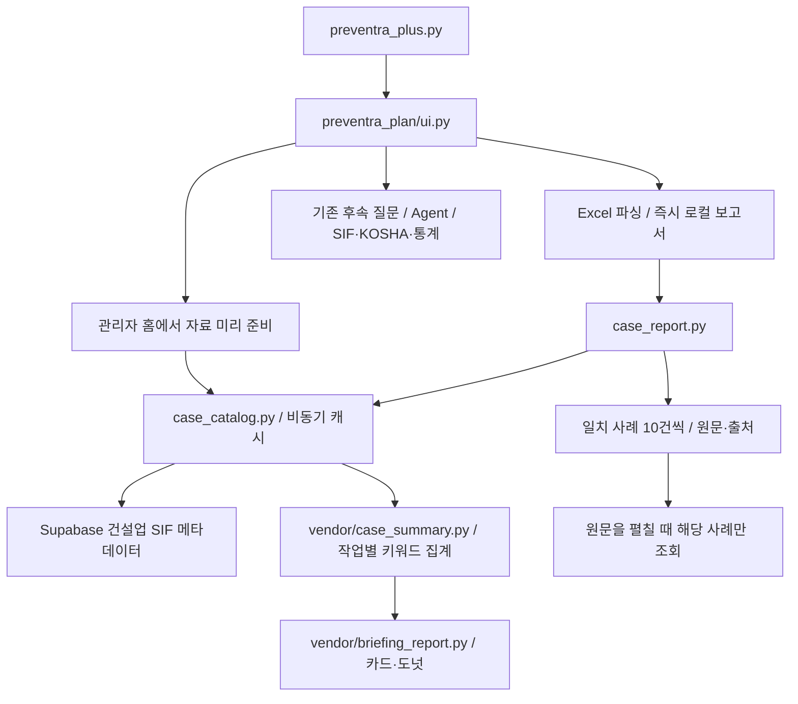

# 작업계획 사고사례 보고서 복원

## 원인과 판단

기존 보고서는 챗봇 `services/safety_rag.py`의 검색을 재사용했다. 이 검색은 후보를 재정렬한 뒤 `TOP_K = 3`으로 제한한다. 반환값을 12개까지 표시하도록 잘라도 이미 세 건뿐이므로 늘어나지 않는다.

팀원의 `src_v2/shining_chatbot/case_summary.py`는 다른 방식이다. 건설업 자료 전체에서 작업명·장비 키워드로 집합을 만들고 재해 유형을 집계한다. 제공된 팀원 진입점에서는 업로드 뒤 주의사항 요청을 등록하며 그래프는 안전교육브리핑 분기에 있다. 따라서 업로드 때마다 완전한 그래프 보고서가 즉시 나온다는 설명까지는 코드로 확인되지 않는다. 재사용 가능한 집계·렌더러를 현재 업로드 미리보기와 저장된 계획서 보고서에 자동 연결했다.

## 재사용과 연결

- 팀원 원본 `src_v2`와 기존 `app.py`는 수정하지 않는다.
- `vendor/case_summary.py`: 일반어 제외, 작업 키워드 우선, 없으면 장비 키워드, 5건 이상 일치, 그중 가장 적게 일치하는 단어 선택 규칙을 보존한다. 전체 일치 사례 ID를 추가했다.
- `case_catalog.py`: 팀원 환경 전용 parquet 경로 대신 기존 Supabase PostgreSQL의 `rag_day1_documents`를 사용한다. `kind=sif_case`, `metadata.group=건설업`, `source_id` 중복 제거. 작업중분류→work_name, 작업소분류→unit_work, 기인물→causal_object, 재해종류→accident_type, 재해유발요인→trigger_factor. 위험감소대책은 임의로 생성하지 않는다.
- DB 설정은 기존 `preventra_settings.database_settings()`를 재사용한다. 새 환경변수·패키지·Storage 파일 업로드가 필요 없다.
- 연결 제한 5초, 쿼리 제한 7초, 읽기 전용 연결. 최초에는 메타데이터만 조회한다. 사례 원문은 사용자가 해당 항목을 펼칠 때 조회한다.
- DB별 진행 중 요청 하나, 성공 캐시 1시간, 실패 캐시 30초. 관리자 홈에서 미리 요청하고 보고서는 준비되는 즉시 자동 갱신한다. 요청 대기 중에도 계획 보고서와 질문 입력을 표시한다. 실패하면 재시도 버튼을 제공한다.
- 같은 작업명·장비 조합을 묶되 모든 계획 작업 ID를 남긴다. 작업 카드 4개씩, 사례 10개씩 페이지를 넘겨 전체를 확인한다.
- 팀원 카드·도넛 SVG를 재사용한다. 현재 Streamlit에서 inline SVG가 제거되므로 자체 스타일을 포함한 SVG 이미지로 표시한다. 동적 카드 문구는 이스케이프한다.
- 각 집계의 키워드와 검색 필드, 원본 파일·시트·연번·ID를 표시한다. 집계는 키워드 일치 빈도이며 개별 사례의 적합성 순위나 현장 사고율이 아니다. 5건 미만은 빈 결과로 설명한다.
- 일반 챗봇의 TOP_K, Agent, Supabase 대화 저장·복원, 인용, Langfuse 구현은 이번 변경에서 수정하지 않았다.

## 검증 결과 (2026-10-07)

실제 연결된 DB의 건설업 SIF 중복 제거 결과 3,459건을 읽기 전용으로 확인했다. 제공된 샘플 계획서 2026-10-12 기준:

|작업|선택 키워드 / 필드|일치 사례 수|
|---|---|---:|
|외벽 비계 해체|비계 / 작업명·단위작업|98|
|창호 자재 반입|창호 / 작업명·단위작업|61|
|환기 덕트 설치|고소작업대 / 기인물 (장비 대체)|173|

첫 메타데이터 조회는 해당 환경에서 약 6.7초, 적재 후 작업별 집계는 약 0.01초였다. 첫 원격 조회가 즉시 끝난다는 보장은 하지 않는다. 계획 내용은 먼저 보이고 사고 보고서는 준비된 뒤 자동 표시된다.

검사 28개 통과: 집계·데이터/캐시 7개, 실제 v3 AppTest 6개, 기존 Agent 11개, 관찰 3개, 저장 snapshot 계약 1개. 비동기 대기·실패, 작업자/관리자 후속 질문 및 날짜별 복원, 3건 초과 집계·출처 페이지, 인용 보존, SVG 이미지 생성·이스케이프 포함.

실제 Streamlit 1.64 브라우저에서 세 도넛 이미지의 로딩과 98/61/173 표기를 확인했다. 브라우저에서는 가상 대화 이력과 제공된 샘플 계획서를 사용하고 사고 자료만 실제 DB에서 읽었다. 실제 대화 DB 쓰기, 유료 모델 응답, Langfuse Cloud 수신, Cloud 배포까지 확인한 것은 아니다.
