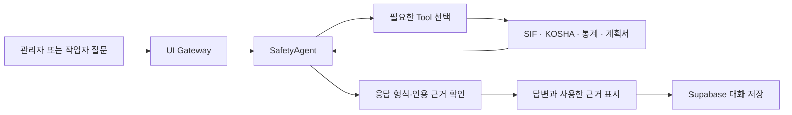

# Preventra Plus v3 · Agent 구성

## 실행과 설정

앱 진입점은 `preventra_plus.py`이며 [배포 안내](STREAMLIT_CLOUD_SETUP.md)의 Supabase·OpenAI 설정을 사용한다.

## 구현 위치

- `preventra_agent/agent.py`: 모델과 Tool의 제한된 반복 처리, 최종 답변 검증
- `preventra_agent/models.py`: 응답·근거·Tool 결과 형식
- `preventra_agent/tools.py`: 검색·통계 Tool 어댑터
- `preventra_agent/observability.py`: 설정된 경우에만 사용하는 Langfuse Cloud 추적과 마스킹
- `preventra_plan/agent.py`: 계획서가 연결된 관리자 요청의 계획 조회 Tool
- `preventra_ui/gateway.py`: 앱 요청과 표시 결과의 변환
- `preventra_settings.py`: Cloud Secrets를 우선하는 공통 설정

## 근거와 저장

이번 요청에서 성공한 Tool 결과의 근거를 답변에 인용한다. 답변과 근거 ID의 일치 여부를 확인하며, 관리자 요청은 제출 당시의 계획 문맥을 대화에 함께 보존한다.

Langfuse 키가 없거나 추적 초기화가 실패하면 상담을 계속할 수 있다. 추적용 마스킹에는 공통 설정에서 읽은 실제 비밀값을 사용하며 .env를 별도로 읽지 않는다.

원본 사고자료의 새 적재·재임베딩과 유료 모델 실행은 이번 Cloud 코드 수정에서 수행하지 않았다. 과거 앱의 테스트 결과는 v3의 실행 확인 결과로 사용하지 않는다.
