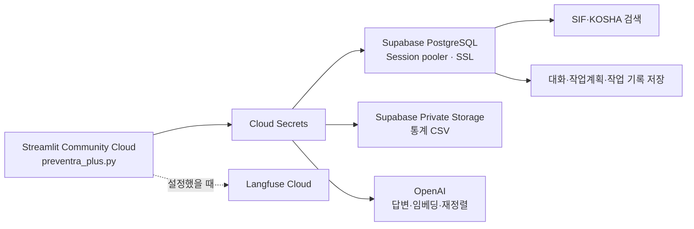

# Preventra Plus v3 · Supabase / Streamlit Community Cloud

## 실행 진입점

- 앱 파일: `src_v3/Project_1/preventra_plus.py`
- 앱 의존성: `src_v3/Project_1/requirements.txt`
- 권장 Python: **3.12**
- 이 폴더의 코드만으로 관리자 계획서와 작업자 상담 화면을 실행한다. 다른 버전의 Project_1이나 로컬 CSV 폴더를 실행 경로에 추가할 필요가 없다.

## 연결 구조



Supabase와 같은 프로젝트의 PostgreSQL 연결 문자열이 필요하다. IPv4 환경에서는 Session pooler 5432를 권장한다. 코드가 SSL을 적용하며 localhost 기본값으로 전환하지 않는다. [Supabase 연결 문서](https://supabase.com/docs/guides/database/connecting-to-postgres)

## Cloud 배포 설정

1. 이 변경이 올라간 GitHub 저장소와 브랜치를 선택한다.
2. Main file path를 **`src_v3/Project_1/preventra_plus.py`**로 지정한다.
3. Advanced settings에서 Python **3.12**를 선택한다.
4. Secrets에 기존 프로젝트의 실제 설정을 붙여 넣는다. 형식은 [예시 파일](.streamlit/secrets.toml.example)에 있다.
5. Deploy를 실행한다. 배포 후 Secrets를 변경했다면 앱을 재시작해 연결 캐시를 갱신한다.

Community Cloud는 진입점 폴더의 의존성 파일을 먼저 확인하므로 이 앱의 requirements.txt를 사용한다. [의존성 문서](https://docs.streamlit.io/deploy/streamlit-community-cloud/deploy-your-app/app-dependencies)

Secrets는 앱 설정으로 공급한다. .env 또는 실제 secrets.toml을 Git에 올리지 않는다. [Cloud Secrets 문서](https://docs.streamlit.io/deploy/streamlit-community-cloud/deploy-your-app/secrets-management)

## 필요한 설정

권장 형식은 `[preventra]` 섹션이며 기존 root-level 키도 지원한다.

| 키 | 용도 |
| --- | --- |
| SUPABASE_URL | 같은 프로젝트의 HTTPS API URL |
| SUPABASE_DB_URL | Session pooler PostgreSQL URL. DATABASE_URL도 호환 |
| OPENAI_API_KEY | 답변·임베딩·재정렬 |
| SUPABASE_SECRET_KEY | 서버에서 Private Storage CSV를 읽는 sb_secret_ 키 |
| SUPABASE_STORAGE_BUCKET | 기존 통계 CSV가 들어 있는 버킷 이름 |
| PREVENTRA_HISTORY_SCOPE | 기존 대화·작업 기록의 작업공간 구분. 기본값은 preventra-local |
| LANGFUSE_PUBLIC_KEY / LANGFUSE_SECRET_KEY / LANGFUSE_BASE_URL | 선택적인 Cloud 추적 |

설정 우선순위는 **Cloud Secrets의 preventra 섹션 → root-level Secrets → 환경변수 → 앱의 로컬 secrets.toml**이다. DB 별칭도 이 순위를 따르므로 환경변수의 SUPABASE_DB_URL이 Cloud의 DATABASE_URL을 덮지 않는다.

PREVENTRA_HISTORY_SCOPE는 사용자 인증 기능이 아니다. 같은 scope로 실행한 세션은 같은 작업공간의 기록을 조회한다. 접근 범위는 배포 앱의 공유 설정으로 관리한다.

## 기존 Supabase 데이터와 권한

기존 프로젝트를 그대로 연결한다. 아래 검색 데이터는 미리 적재돼 있어야 한다.

- `public.rag_day1_documents`: SIF 사례와 기존 2025 통계 문서
- `public.langchain_pg_collection`, `public.langchain_pg_embedding`: `kosha_guides` 컬렉션
- 검색 임베딩: `text-embedding-3-small`, 1,536차원

대화·계획 저장 테이블은 앱이 초기화할 때 생성하거나 기존 구조에 필요한 열을 추가한다.

- `chat_history`
- `preventra_conversations` — work 기록 구분과 work_days 포함
- `preventra_work_plans` — 대화별 계획 스냅샷·revision

DB 사용자에게 위 테이블에 필요한 조회·쓰기 및 초기화 권한이 있어야 한다. 이 변경은 원본 사고자료를 업로드하거나 새로 임베딩하지 않는다.

통계는 Private Storage의 기존 18개 CSV를 우선 읽는다.

- 루트: `accident_injured_2025.csv`, `accident_death_2025.csv`, `business_count_2025.csv`, `fatality_rate_2025.csv`
- history/: 2020~2024년의 재해자·사망자·사망만인율 CSV
- 제공되지 않은 2021년 사망만인율은 결측으로 유지한다.

Storage가 설정되지 않았거나 조회가 실패하면 **동일 Supabase DB의 기존 2025 통계**를 사용할 수 있다. 이때 2020~2024년 추세 자료의 부재를 안내하며, 장기 추세를 만들어 채우지 않는다. 기본 실행에서 로컬 CSV는 읽지 않는다.

## 로컬에서 같은 설정으로 실행

앱 전용 실제 설정은 `src_v3/Project_1/.streamlit/secrets.toml`에 둔다. 이 파일은 Git에서 제외되고, 실행 작업 디렉터리와 관계없이 코드가 찾는다.

```bash
python -m pip install -r src_v3/Project_1/requirements.txt
python -m streamlit run src_v3/Project_1/preventra_plus.py
```

기존 .env 방식을 의도적으로 사용할 때만 `PREVENTRA_LOAD_DOTENV=true` 환경변수를 지정한다. 앱과 저장소의 .env를 선택적으로 읽으며 localhost DB는 허용하지 않는다.

선택 실행기는 `python src_v3/Project_1/preventra_ui_v2/run_app.py`다. 같은 preventra_plus.py를 실행하며 주소·포트를 코드에서 고정하지 않는다.

## 이번 변경의 확인 범위

Python 문법, 설정·경로·의존성 구성, 변경 내용 및 비밀 파일의 Git 제외 여부를 정적으로 확인했다. 코드 테스트, 실제 Supabase 접속 실행, 유료 모델 호출 및 Community Cloud 배포는 이번 작업에서 실행하지 않았다. 과거 버전의 실행 기록을 v3의 검증 결과로 사용하지 않는다.
